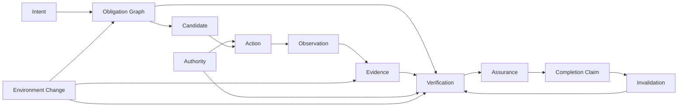
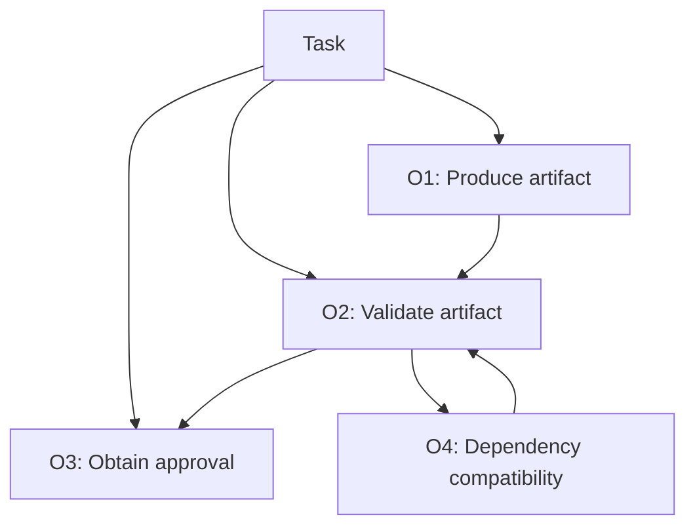
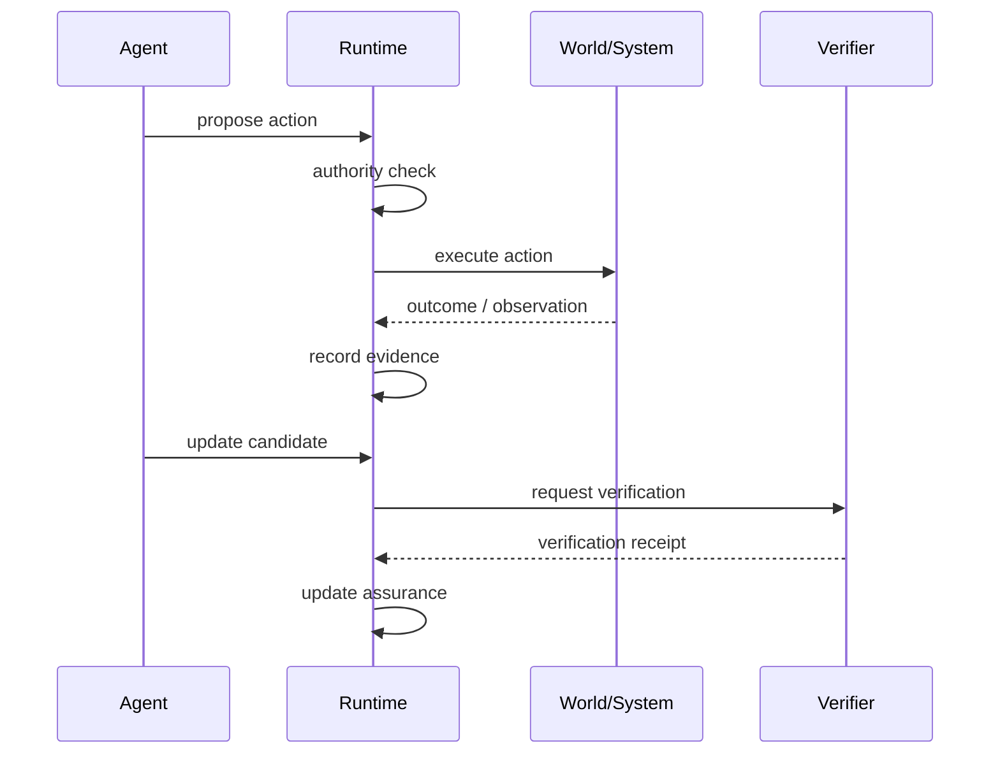
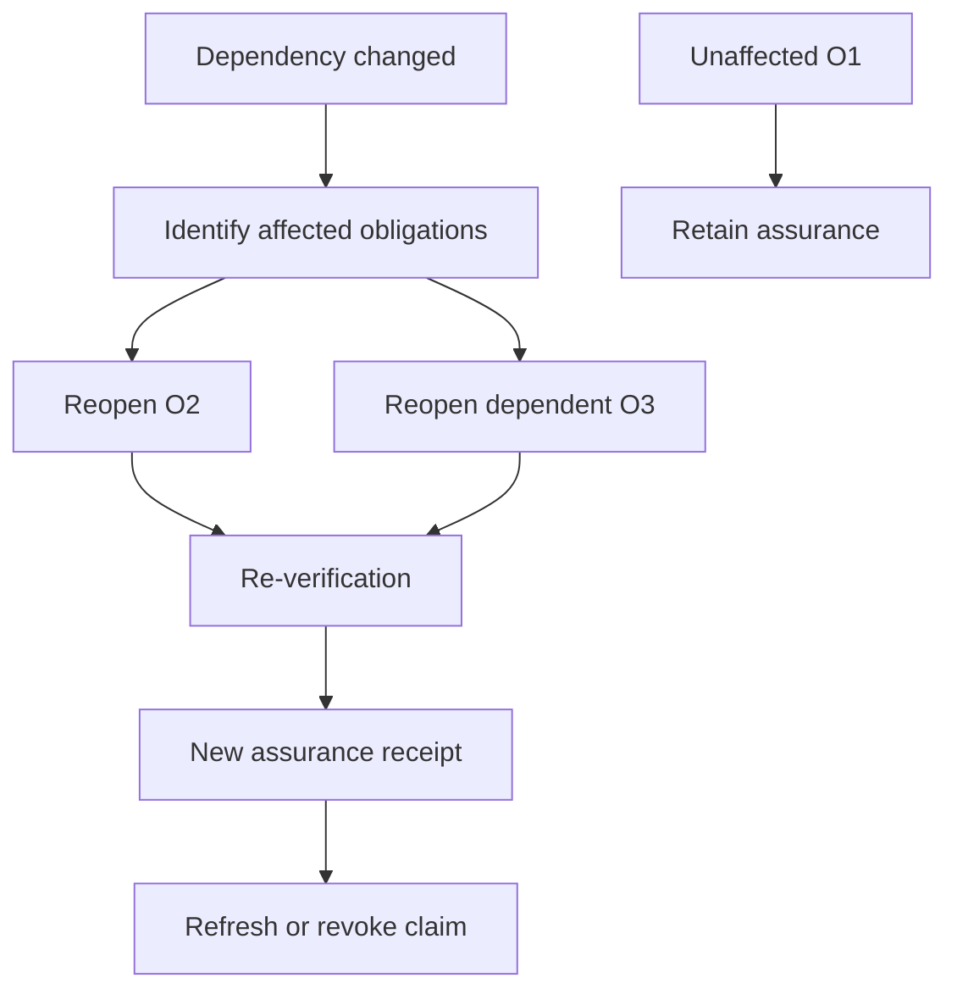
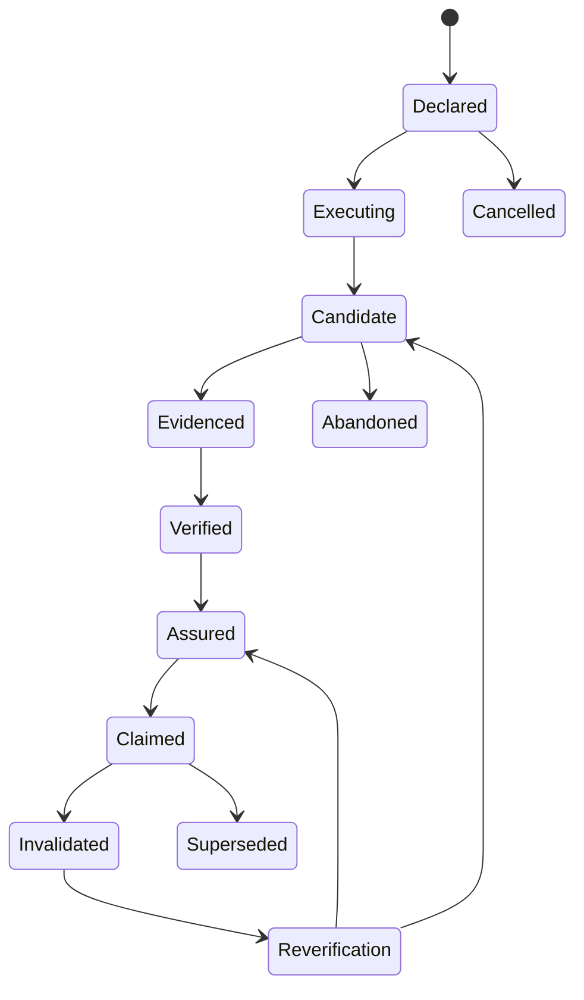
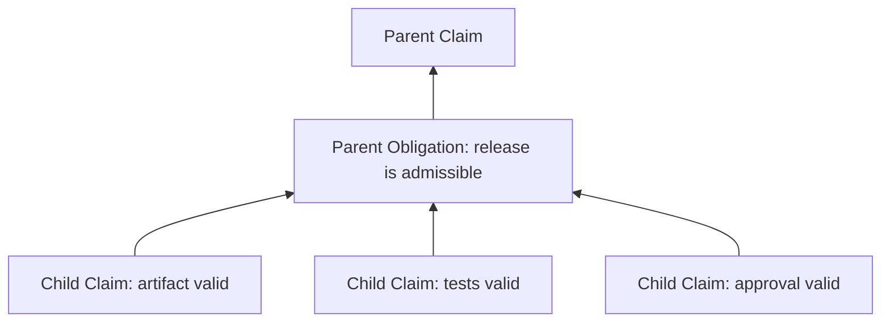
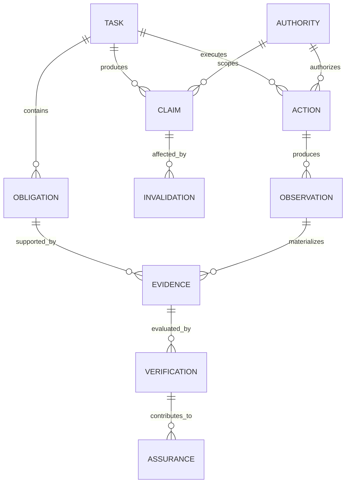
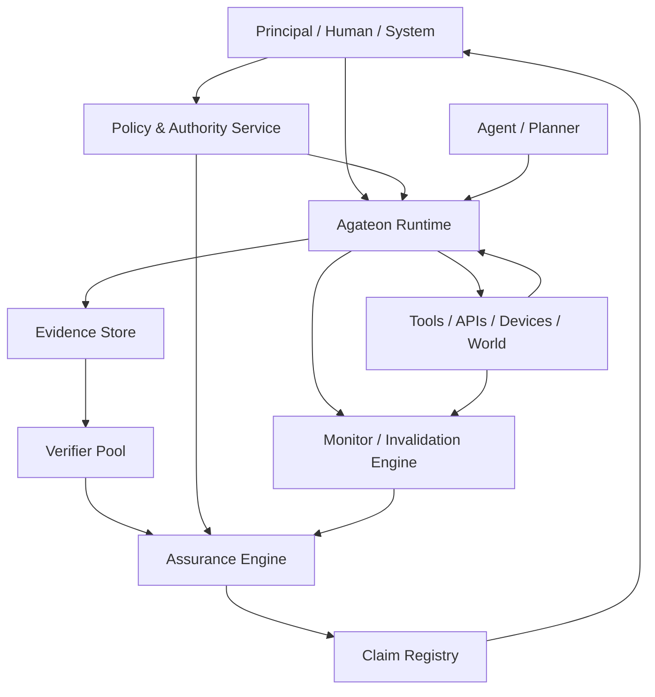

# Agateon Protocol — Complete Design Plan

**Status:** Review-passed design baseline
**Version:** 0.3
**Date:** 2026-09-30
**Scope:** Core protocol design, assurance semantics, state model, evidence model, authority, invalidation/recovery, domain profiles, reference implementation, evaluation, and rollout

---

## 0. Executive Summary

Agateon should not be designed primarily as a workflow engine, a P0–P8 checklist, or an agent benchmark. Its core problem is narrower and more fundamental:

> **How can an agent make a trustworthy claim that a task is complete when execution is open-ended, evidence can be incomplete or adversarial, authority is bounded, and the world can change after actions have occurred?**

The proposed core is therefore an **assurance protocol for completion claims**.

The protocol separates six concerns:

1. **Intent** — what a human or organization wants.
2. **Obligation** — what must be true for the declared task to count as complete.
3. **Authority** — what the agent is permitted to do.
4. **Candidate** — the agent's current proposed task state/result.
5. **Evidence + Verification** — why specific obligations are believed to hold.
6. **Claim** — the externally consumable assertion of completion, with scope and validity conditions.

The protocol deliberately does **not** attempt to prove that the original human intent was optimal, wise, or even correctly specified. It establishes execution truth, not intent truth.

The core invariant is:

> **No completion claim is valid unless every required obligation is satisfied by admissible evidence, verified under an applicable verification policy, within the authority and validity scope of that claim.**

A second invariant is equally important:

> **A previously valid claim can become invalid without the historical execution becoming false.**

This allows Agateon to represent real-world tasks as living objects rather than one-shot success/failure values.

---

# 1. Design Goals and Non-Goals

## 1.1 Goals

### G1 — Make completion claims evidence-grounded
A claim must identify the obligations it covers and the evidence/verifications supporting those obligations.

### G2 — Separate execution from assurance
An agent may execute actions and construct candidates, but completion is a protocol-level claim rather than an untrusted self-report.

### G3 — Support changing environments
Dependencies, inputs, policies, resources, and external state may change while a task is executing or after it is claimed complete.

### G4 — Support partial progress
A large task must not restart merely because one obligation is invalidated. Only affected obligations and dependent claims should reopen.

### G5 — Make authority explicit
Actions must be evaluated against declared authority, not merely against whether a tool call technically succeeds.

### G6 — Resist specification gaming
The protocol must distinguish “the visible test passed” from “the required property was established,” including hidden/adversarial verification where appropriate.

### G7 — Remain domain-neutral
The core must work for software, research/analysis, business operations, physical/device tasks, and other agentic workflows.

### G8 — Be implementable incrementally
A minimal implementation should be possible without requiring formal methods, a blockchain, a new agent framework, or a centralized evaluator.

## 1.2 Non-goals

Agateon will not attempt to:

- infer the user's true psychological intent;
- decide whether a task specification is morally or commercially desirable;
- replace planning frameworks or agent harnesses;
- prescribe a universal workflow such as P0–P8;
- guarantee that an agent will never make mistakes;
- turn every obligation into a formally verified theorem;
- define a universal risk score or “agent quality” ranking;
- replace domain-specific regulation or professional sign-off.

---

# 2. Core Conceptual Model

The protocol is organized around an **Obligation Graph**, not a fixed sequence of phases.



The fundamental unit is not “phase.” It is **an obligation whose satisfaction can be evidenced and verified**.

## 2.1 Seven protocol primitives

The normative core contains seven primitives:

| Primitive | Purpose | Produced by | Mutability |
|---|---|---|---|
| Intent | Human/org objective context | Principal | Versioned |
| Obligation | Explicit completion condition | Principal/delegated authority | Versioned |
| Authority | Allowed actions/effects | Principal/policy authority | Versioned |
| Candidate | Proposed/current task state | Agent | Mutable/versioned |
| Evidence | Observable support for a proposition | Runtime/agent/external system | Append-only |
| Verification | Determination that evidence supports an obligation | Verifier | Append-only |
| Claim | Scoped assertion about task completion | Protocol actor | Versioned/revocable |

A practical implementation also needs non-normative supporting objects: Action, Observation, Dependency, Policy, Artifact, Event, and Receipt.

---

# 3. The Central Abstraction: Completion Claim

A completion claim is not simply `status=success`.

A claim is a structured assertion:

```text
Claim(task=T,
      obligations={O1,O2,O3},
      evidence={E1,E2,E3},
      verifications={V1,V2,V3},
      authority=A,
      validity_scope=S,
      valid_until=t,
      dependency_snapshot=D,
      issuer=Q)
```

The claim answers:

- What exactly is claimed?
- Which obligations does it cover?
- What evidence supports each obligation?
- Who/what verified that evidence?
- Under which policy/version?
- Under which authority?
- Against which artifact/environment/dependency snapshot?
- For how long is the claim intended to remain valid?
- What events would invalidate it?

## 3.1 Claim levels

Agateon should distinguish at least four states:

1. **Candidate** — agent believes the task may be complete.
2. **Assured** — all required obligations currently satisfy the assurance policy.
3. **Claimed** — an authorized actor has emitted an externally consumable completion claim.
4. **Invalidated** — a prior claim is no longer valid under its declared conditions.

`Claimed` does not mean permanent truth. It means a bounded assertion with a defined validity scope.

---

# 4. Obligation Graph

## 4.1 Why obligations instead of P0–P8

P0–P8 is useful as an implementation workflow, but it is too sequential and software-development-shaped to be the protocol's ontology.

Agateon should represent a task as a graph:



Obligations may be:

- conjunctive: all required;
- alternative: one of several acceptable proofs;
- conditional: required only if a predicate holds;
- delegated: satisfied by an external system or authority;
- derived: generated when a dependency changes;
- temporal: must remain true for a declared interval.

## 4.2 Obligation schema

Minimum fields:

```yaml
obligation:
  id: O-001
  task_id: T-001
  statement: "Artifact A conforms to schema S"
  type: property
  required: true
  dependencies: [artifact:A, schema:S]
  acceptance:
    mode: verifier_defined
    policy: schema-conformance/v1
  invalidation_triggers:
    - artifact_changed
    - schema_changed
    - verifier_policy_changed
```

An obligation must be expressed sufficiently clearly that a verifier can determine what evidence would count.

---

# 5. Authority Model

Authority is a first-class primitive because successful execution is not equivalent to authorized execution.

## 5.1 Authority dimensions

An authority grant should be scoped by:

- actor/agent identity;
- action/tool capability;
- target/resource;
- purpose/task;
- allowed side effects;
- time window;
- budget/quantity;
- escalation requirements;
- revocation condition.

Example:

```yaml
authority:
  id: A-17
  principal: org:user-123
  delegate: agent:abc
  scope:
    task: T-001
    tools: [git.read, git.write, test.run]
    repositories: [repo-x]
    branches: [feature/*]
  limits:
    network: denied
    production_deploy: denied
    spend_usd: 0
  expires_at: 2026-10-01T00:00:00Z
```

## 5.2 Effect-boundary rule

Authorization must be checked immediately before material side effects, not only at planning time.

This protects against stale plans, changed permissions, and time-of-check/time-of-use gaps.

---

# 6. Candidate and Execution Model

The agent may internally plan and act however it wants, subject to authority and policy. Agateon does not prescribe a planner architecture.

The runtime records a normalized execution trace:



A command acknowledgement must never be treated as proof of intended effect unless the relevant evidence policy explicitly says so.

This distinction is critical for physical systems, APIs with asynchronous effects, distributed systems, and any environment where an accepted command can fail to produce the desired state.

---

# 7. Evidence Model

Evidence is the bridge between execution and assurance.

## 7.1 Evidence properties

Evidence should be:

- **bound** to an exact artifact/state/action where applicable;
- **provenanced** — source and producer known;
- **timestamped**;
- **scoped** — what it does and does not establish;
- **freshness-aware**;
- **tamper-evident** where risk requires;
- **reproducible** where possible;
- **admissible** under the verification policy.

## 7.2 Evidence is not proof by itself

An agent-generated statement such as “tests passed” is evidence only if the evidence policy accepts the underlying test execution, test identity, environment, result, and provenance.

The protocol therefore separates:

```text
Observation → Evidence → Verification → Assurance
```

rather than:

```text
Agent says done → Done
```

## 7.3 Evidence bundle

```yaml
evidence:
  id: E-991
  subject:
    artifact: artifact-A@sha256:...
    obligation: O-001
  source:
    type: runtime
    actor: verifier-runner-3
  observation:
    test_suite: suite-X@v4
    result: pass
  provenance:
    execution_id: EX-88
    environment_digest: sha256:...
  observed_at: 2026-09-30T20:00:00Z
  valid_until: 2026-10-01T20:00:00Z
```

---

# 8. Verification Model

Verification is a decision about whether evidence establishes an obligation under a policy.

## 8.1 Verification modes

Agateon should support profiles rather than one universal verifier:

1. **Deterministic verification** — hashes, schemas, exact state predicates.
2. **Test-based verification** — test suites and assertions.
3. **Reference comparison** — expected artifact/result comparison.
4. **Human verification** — authorized human review.
5. **Independent agent verification** — separate verifier model/process.
6. **Multi-party verification** — quorum or role-separated approval.
7. **Runtime monitoring** — continuous property observation.
8. **Probabilistic/heuristic verification** — allowed only when explicitly declared and never silently represented as deterministic proof.

## 8.2 Independence

The riskier the obligation, the stronger the required separation should be between producer and verifier.

For example:

- low-risk: same runtime may perform deterministic validation;
- medium-risk: independent verification process;
- high-risk: separate authority and human approval may be required.

Agateon should not encode a universal risk ranking. Domain profiles define it.

---

# 9. Assurance Gate

An assurance gate evaluates whether a claim can be issued or maintained.

Conceptually:

```text
Assure(T) iff
  RequiredObligations(T) ⊆ VerifiedSatisfied(T)
  ∧ AuthorityValid(T)
  ∧ EvidenceAdmissible(T)
  ∧ DependenciesCurrent(T)
  ∧ NoBlockingInvalidation(T)
```

The result should be a **receipt**, not merely a Boolean.

```yaml
assurance_receipt:
  id: AR-1001
  task_id: T-001
  decision: assured
  obligations:
    O-001: V-10
    O-002: V-11
    O-003: V-12
  policy: assurance/default/v1
  authority: A-17
  dependency_snapshot: D-77
  issued_at: 2026-09-30T20:15:00Z
  invalidation_rules:
    - artifact_changed
    - dependency_changed
    - authority_revoked
```

---

# 10. Dynamic State and Invalidation

This is the feature that differentiates Agateon from ordinary workflow systems.

## 10.1 Three change classes

### Requirement change
The obligation graph changes.

### Environment change
The world or external system changes.

### Evidence invalidation
Previously sufficient evidence no longer applies.

Examples:

- dependency version changes;
- source data changes;
- permissions expire;
- artifact is modified;
- verifier policy changes;
- an external service reports a state change;
- a time-bound condition expires.

## 10.2 Local re-opening

Agateon must reopen only affected obligations and dependent claims.



This prevents a long-running task from degenerating into “restart from zero.”

## 10.3 Assurance Debt

When execution progress remains valid but assurance has become incomplete, represent the gap explicitly:

```yaml
assurance_debt:
  task: T-001
  affected_obligations: [O-002]
  cause: dependency_changed
  execution_status: preserved
  claim_status: suspended
  remediation: reverify
```

“Assurance debt” is not task failure. It is a measured gap between current execution state and current claimability.

---

# 11. Claim Lifecycle State Machine



Important semantics:

- `Candidate` is an agent state, not an externally trusted result.
- `Verified` means required verification decisions exist; `Assured` additionally checks global claim conditions.
- `Claimed` means an authorized issuer has emitted a claim.
- `Invalidated` means the claim no longer holds under its own declared validity rules.
- Historical evidence remains; invalidation does not erase history.

---

# 12. Claim Composition and Dependency Closure

Agateon must support claims about large tasks without forcing every verifier to re-evaluate the entire task.

A claim may reference lower-level claims, but composition is valid only when the parent obligation explicitly accepts the child claim type and scope.



Every composed claim therefore has a **dependency closure**: the set of evidence, verifications, policies, authorities, artifacts, and child claims on which its validity depends.

If any dependency is invalidated, the invalidation engine computes the affected closure rather than resetting the entire task.

This also establishes a useful scalability rule:

> **Task size is unconstrained by the protocol; assurance cost is proportional to the affected dependency closure, not necessarily to the total task.**

---

# 13. Minimal Protocol Object Model

The first interoperable release should standardize the following objects:

```text
Task
Intent
Obligation
Authority
Action
Observation
Evidence
Verification
AssuranceReceipt
Claim
InvalidationEvent
```

The protocol should use immutable IDs and explicit versions.

## 12.1 Required relationships



---

# 14. Protocol API Shape

A reference transport can initially use HTTP/JSON or message-bus events. Transport is not part of the semantic core.

Minimum operations:

```text
POST /tasks
POST /tasks/{id}/obligations
POST /tasks/{id}/authority
POST /tasks/{id}/actions
POST /tasks/{id}/observations
POST /tasks/{id}/evidence
POST /tasks/{id}/verifications
POST /tasks/{id}/assurance
POST /tasks/{id}/claims
POST /tasks/{id}/invalidations
GET  /tasks/{id}/state
GET  /claims/{id}
GET  /claims/{id}/evidence
```

Event-oriented deployments should additionally emit:

```text
TaskDeclared
ObligationAdded
AuthorityGranted
ActionProposed
ActionAuthorized
ActionExecuted
ObservationRecorded
EvidenceProduced
VerificationCompleted
AssuranceGranted
ClaimIssued
DependencyChanged
ClaimInvalidated
ClaimSuperseded
```

---

# 15. Canonical Task Example: Software Engineering

Task:

> “Upgrade service X to dependency Y, preserve behavior, pass required tests, and produce a reviewable change.”

Obligations:

```text
O1: dependency version updated correctly
O2: build succeeds
O3: required tests pass
O4: no declared compatibility regression
O5: diff is reviewable
```

Agent may perform dozens of actions, but Agateon only needs to track the evidence relevant to these obligations.

If a hidden dependency changes after O1–O4 are verified:

```text
Execution progress: preserved
O1: still satisfied
O2: potentially affected
O3: affected
O4: affected
O5: still satisfied
Claim: suspended
Assurance debt: O2,O3,O4
```

The agent does not restart the whole task. It repairs the assurance gap.

---

# 16. Cross-Domain Validation

The core must be tested against at least three substantially different domains.

## 15.1 Software

Target properties:

- artifact correctness;
- tests;
- dependency freshness;
- authorization to merge/deploy;
- rollback and re-verification.

## 15.2 Research / Analysis

Example:

> “Produce a market analysis using approved sources and cite every material factual claim.”

Obligations may include:

- source set satisfies policy;
- every material claim has source evidence;
- data timestamp is within freshness window;
- calculations reproduce;
- uncertainty is disclosed where required.

The task remains valid even though there is no single binary “test suite.”

## 15.3 Business / Physical Operation

Example:

> “Prepare and execute an inventory transfer.”

Obligations:

- transfer authorized;
- source inventory exists;
- destination accepts transfer;
- physical/system state matches expected state;
- reconciliation completed.

This domain exposes the difference between command acknowledgement and actual effect, which is central to execution assurance.

---

# 17. Legitimate-but-Wrong Specification / “Legal Fake Requirement”

Agateon should treat this as a boundary condition rather than claim to solve it.

Example:

```text
Human intent: achieve X
Specification: do Y
Y is perfectly satisfied
```

Agateon can establish:

> “Y was executed and the declared obligations for Y were satisfied.”

It should not assert:

> “Y was what the human truly wanted.”

The architecture should therefore preserve a traceable distinction:

```text
Intent metadata
    ↓
Specification / Obligations
    ↓
Execution
    ↓
Evidence
    ↓
Assurance
    ↓
Claim
```

If the principal wants stronger intent assurance, that becomes a separate **intent-governance profile**, not a hidden assumption in the core protocol.

---

# 18. Specification-Gaming Resistance

Agateon cannot eliminate gaming, but it can make several common shortcuts structurally visible.

## 17.1 Required defenses

### D1 — Evidence scope binding
Evidence must specify exactly what proposition it supports.

### D2 — Artifact/environment binding
Verification must be bound to the relevant artifact and environment snapshot.

### D3 — Independent verification profiles
High-value obligations may require verification not controlled by the producing agent.

### D4 — Hidden/adversarial checks
Where public tests are insufficient, profiles can require hidden or randomly selected verification.

### D5 — Negative evidence
The absence of expected evidence must not silently become success.

### D6 — Effect verification
Tool-call acknowledgement is not sufficient where the intended effect is independently observable.

### D7 — Authority/effect separation
A technically possible action is not automatically an authorized action.

### D8 — Revalidation at effect boundaries
Authorization and freshness should be checked again before irreversible or high-impact effects.

---

# 19. P0–P8 Reinterpretation

P0–P8 should be retained only as a **profile / operational recipe**, not as the core ontology.

A possible mapping is:

| P0–P8 concern | Agateon primitive |
|---|---|
| Understand request | Intent / Obligation |
| Clarify scope | Obligation / Authority |
| Plan | Candidate |
| Execute | Action |
| Observe | Observation |
| Produce proof | Evidence |
| Validate | Verification |
| Decide completion | Assurance / Claim |
| Reopen after change | Invalidation / Reverification |

This preserves the useful operational discipline while preventing Agateon from becoming a waterfall process.

---

# 20. Reference Architecture



The reference implementation should be modular so that users can replace the planner, tool layer, evidence store, verifier, or policy engine independently.

---

# 21. Protocol Invariants

The implementation should be tested against a small set of invariants rather than a large collection of procedural rules.

### I1 — No silent claim broadening
A claim cannot cover an obligation, artifact, authority scope, or time range not explicitly represented in the claim.

### I2 — Evidence cannot outrun its scope
Evidence may support only the proposition, artifact, environment, and time scope for which it was admitted.

### I3 — Verification is policy-bound
A verification receipt is meaningful only together with the verification policy/version that produced it.

### I4 — Authority is effect-scoped
A valid plan does not imply valid authority at execution time.

### I5 — History is append-only at the semantic layer
Invalidation, correction, and supersession create new events/receipts; they do not rewrite the historical fact that an earlier claim was issued.

### I6 — Invalidated claims remain inspectable
Invalidation changes present validity, not historical provenance.

### I7 — Reverification is local by default
Only the transitive dependency closure of changed facts is reopened unless a profile explicitly requires global re-evaluation.

### I8 — Missing evidence is not positive evidence
Unknown, unavailable, or unobserved state must never silently satisfy a required obligation.

### I9 — Agent self-report is not privileged
The producer of a candidate cannot automatically elevate its own assertion to an assurance receipt merely by declaring success.

### I10 — Claim validity is time/state scoped
Every claim profile must define what makes its claim stale, invalid, or superseded.

These invariants are the strongest candidates for formalization and property-based conformance testing.

---

# 21. Security and Trust Model

The protocol should explicitly define what it assumes and what it does not.

## 20.1 Trust assumptions

A deployment must declare:

- which identities are trusted;
- which evidence sources are trusted;
- whether runtime logs are tamper-resistant;
- whether verifier code is trusted;
- whether the external world can be observed completely;
- whether clock/time sources are trusted.

## 20.2 Threats

Minimum threat model:

1. agent lies about completion;
2. agent selectively reports evidence;
3. agent exploits verifier blind spots;
4. stale evidence is reused;
5. artifact changes after verification;
6. authority is revoked but cached authorization remains;
7. external state changes after claim;
8. evaluator and producer collude;
9. evidence provenance is forged;
10. task specification itself is under-specified.

Agateon should document which threats each profile mitigates rather than making a blanket security claim.

---

# 22. Formal Semantics to Develop

The v0.1 implementation does not require full formal verification, but the protocol should define a small mathematical core.

Let:

- `O(T)` = required obligations for task T;
- `Sat(O)` = obligations verified as satisfied;
- `Auth(T)` = authority valid for the relevant actions/effects;
- `Fresh(E)` = evidence satisfies freshness constraints;
- `Dep(T)` = dependencies are consistent with the claim snapshot;
- `Inv(T)` = no blocking invalidation exists.

Then:

```text
Assured(T) ⇔
    O(T) ⊆ Sat(O)
    ∧ Auth(T)
    ∧ Fresh(E)
    ∧ Dep(T)
    ∧ ¬Inv(T)
```

A claim is valid only if:

```text
Valid(Claim) ⇔ Assured(T) ∧ ScopeSatisfied ∧ IssuerAuthorized
```

If a dependency changes:

```text
Change(D) → Affected(O) → Reverification(O)
```

rather than:

```text
Change(D) → Reset(T)
```

The formalization should later define dependency closure, temporal validity, alternative proof paths, and compositional claims.

---

# 23. Minimal Interoperability Specification

The first protocol release should standardize:

### Required

- object IDs and versioning;
- obligation representation;
- authority representation;
- evidence provenance;
- verification receipt;
- claim structure;
- invalidation semantics;
- dependency references;
- deterministic state transition rules.

### Optional / profile-specific

- transport;
- cryptographic signatures;
- human approval UI;
- LLM verifier;
- hidden tests;
- risk policy;
- distributed ledger;
- formal proofs;
- domain-specific schemas.

This keeps the core small enough to adopt.

---

# 24. Implementation Roadmap

## Phase 1 — Semantic Core

Deliver:

- protocol vocabulary;
- JSON Schema for core objects;
- state machine;
- claim validity rules;
- invalidation model;
- reference examples.

Exit criterion: two independent implementations can exchange a task, evidence, verification, and claim without interpreting the semantics differently.

## Phase 2 — Reference Runtime

Build:

- task/obligation registry;
- authority middleware;
- event log;
- evidence store;
- verifier interface;
- assurance engine;
- claim registry.

Exit criterion: complete end-to-end task lifecycle works without an LLM-specific dependency.

## Phase 3 — Agent Adapter

Add:

- agent SDK;
- action proposal interface;
- candidate state;
- evidence submission;
- re-verification requests;
- claim request API.

Exit criterion: an existing agent can use Agateon without replacing its planner or tool framework.

## Phase 4 — Dynamic Invalidation

Implement:

- dependency graph;
- change events;
- invalidation propagation;
- assurance debt;
- local re-verification.

Exit criterion: mid-task dependency change causes only affected obligations to reopen.

## Phase 5 — Adversarial Evaluation

Test:

- false completion;
- stale evidence;
- public-test gaming;
- unauthorized action;
- effect/ack mismatch;
- verifier collusion;
- hidden dependency changes;
- partial observability.

Exit criterion: protocol catches defined classes of false claims and emits diagnosable failures.

## Phase 6 — Domain Profiles

Create at least:

- software-engineering profile;
- research/analysis profile;
- business/operations profile;
- optional device/physical profile.

Exit criterion: same core objects work across all profiles without adding domain-specific concepts to the core.

## Phase 7 — Interoperability and Governance

Deliver:

- conformance tests;
- reference implementation;
- profile registry;
- compatibility rules;
- versioning/deprecation policy;
- security model;
- extension mechanism.

---

# 25. Evaluation Plan

Evaluation must test the protocol, not merely the agent.

## 24.1 Primary metrics

Do not collapse all metrics into one score.

Measure separately:

- false completion rate;
- missed completion rate;
- stale-claim rate;
- unauthorized-action rate;
- evidence coverage;
- verification latency;
- invalidation detection latency;
- recovery/re-verification success;
- unnecessary rework;
- assurance overhead.

## 24.2 Core benchmark families

### B1 — Straightforward tasks
Does the protocol allow normal completion without excessive overhead?

### B2 — Long-horizon tasks
Does assurance survive long execution traces?

### B3 — Specification gaming
Can the agent exploit the evaluation boundary?

### B4 — Environment drift
Can the system detect when a valid claim becomes stale?

### B5 — Mid-task change
Can the system preserve unaffected progress?

### B6 — Partial observability
Does it avoid treating missing evidence as proof?

### B7 — Authority violation
Does it block technically possible but unauthorized actions?

### B8 — Cross-domain transfer
Does the same semantic core work outside software?

---

# 26. Conformance Test Suite

A conforming implementation should pass at least these scenarios:

1. all obligations satisfied → claim accepted;
2. one required obligation missing → claim rejected;
3. evidence from wrong artifact → verification rejected;
4. stale evidence → claim rejected or marked stale according to profile;
5. authority expired before effect → action blocked;
6. action acknowledged but effect absent → obligation remains unsatisfied;
7. dependency changes after verification → affected claim invalidated;
8. unaffected obligation retains assurance;
9. re-verification restores claimability;
10. superseding claim preserves previous history;
11. verifier cannot silently broaden evidence scope;
12. agent cannot self-upgrade authority;
13. human approval cannot silently exceed its declared scope;
14. alternative valid proof path can satisfy an obligation;
15. cancellation does not masquerade as successful completion.

---

# 27. Observability and UX

The user-facing representation should not expose raw event streams as the primary interface.

A task dashboard should show:

```text
Task
├── Overall claim: VALID / SUSPENDED / INVALID
├── Obligations
│   ├── O1 ✓ assured
│   ├── O2 ✓ assured
│   ├── O3 ⚠ assurance debt
│   └── O4 ✓ assured
├── Authority
│   └── current / expired / restricted
├── Evidence
│   └── provenance and freshness
└── Change history
    └── what caused re-verification
```

The important UX principle is:

> **Show why a claim is currently valid or invalid, not merely whether a task is green or red.**

---

# 28. Design Decisions and Rationale

## D1 — Obligation graph over fixed phases
Chosen because tasks are non-linear and changes should reopen local requirements.

## D2 — Claim over success Boolean
Chosen because completion is a scoped assertion that needs evidence and validity conditions.

## D3 — Evidence as first-class object
Chosen because execution logs alone are insufficient for assurance.

## D4 — Authority as first-class object
Chosen because successful actions can still be unauthorized.

## D5 — Invalidation as first-class event
Chosen because real-world truth changes after execution.

## D6 — Domain profiles instead of domain-specific core
Chosen to preserve cross-domain compatibility.

## D7 — No universal score
Chosen because a single scalar would obscure which assurance property failed and encourage optimization against the metric.

## D8 — No mandatory blockchain/cryptography
Chosen because provenance and signatures are deployment-dependent; the semantic core should remain lightweight.

---

# 29. Relationship to Current Research Direction

Recent 2026 work reinforces several parts of this design:

- **Execution assurance:** ADF-EA explicitly connects capability contracts, intended effects, evidence requirements, recovery, persistent execution state, and completion authorization. This strongly supports treating effect verification and recovery as protocol concerns rather than planner details.
- **Authorized transitions:** Agile-V describes evidence-bound transitions in which claims are tied to exact artifacts, policy baselines, dependencies, authority, and effect boundaries. This supports Agateon's claim/receipt/effect-boundary model.
- **Continuous assurance:** Agent-integrated software research argues for interaction contracts and continuous assurance as user goals and shared state change. This supports invalidation and local re-verification.
- **Evaluation beyond visible task success:** Contemporary agent benchmarks demonstrate that exact task success can be insufficient and that environment-aware evaluation is necessary. This supports evidence scope and hidden/adversarial verification profiles.
- **Safety assurance lineage:** Safety assurance cases already use claims, arguments, and evidence to justify system properties; Agateon adapts the underlying discipline to dynamic agent execution rather than copying a fixed safety-case process.

These works are evidence for design directions, not proof that the Agateon design is correct. The protocol still needs empirical validation.

---

# 30. Independent Review Record

This design was reviewed as a separate pass after drafting. The review criteria were:

1. conceptual coherence;
2. cross-domain applicability;
3. resistance to specification gaming;
4. handling of mid-task changes;
5. authority correctness;
6. evidence/provenance sufficiency;
7. non-reliance on a waterfall workflow;
8. implementability;
9. interoperability;
10. clarity of protocol boundary.

## Review pass 1 — Findings

### Finding R1 — “Intent” risked becoming an implicit correctness oracle
**Resolution:** explicitly define Intent as contextual provenance, while Obligation is the normative completion condition. Agateon does not prove that the specification matches the human's hidden intent.

### Finding R2 — Evidence and verification could be conflated
**Resolution:** Evidence is an artifact/observation with provenance; Verification is a decision under a policy. They are separate protocol objects.

### Finding R3 — A task could be technically complete but claim-invalid
**Resolution:** explicitly distinguish execution state from assurance state and add Assurance Debt.

### Finding R4 — Authority could become a one-time preflight check
**Resolution:** add effect-boundary reauthorization and explicit expiry/revocation semantics.

### Finding R5 — Invalidation could cause full task restart
**Resolution:** define dependency-scoped invalidation and local obligation reopening.

### Finding R6 — Domain neutrality could become superficial
**Resolution:** require three cross-domain reference profiles before calling the core domain-neutral.

### Finding R7 — Gaming defenses could accidentally become a universal testing prescription
**Resolution:** make hidden tests, independent verifiers, human review, etc. profile-specific verification modes.

### Finding R8 — Protocol could become too large
**Resolution:** keep seven semantic primitives normative; treat Action, Observation, Policy, Dependency, Event, and Receipt as supporting objects; defer transport and cryptography to implementation/profile layers.

## Review pass 2 — Adversarial architecture review

A second, deliberately skeptical pass checked for failure modes that the first review could have missed.

### Finding R9 — Large tasks could still imply whole-task verification
**Resolution:** add claim composition and dependency closure. Assurance cost is defined over the affected closure, not total task size.

### Finding R10 — Parent claims could hide stale child claims
**Resolution:** composed claims inherit validity dependencies from child claims; invalidation propagates through the closure.

### Finding R11 — Correctness could silently broaden from one artifact/version to another
**Resolution:** add explicit no-silent-broadening invariant and artifact/environment binding.

### Finding R12 — Historical truth could be confused with current validity
**Resolution:** semantic history is append-only; invalidation creates a new event and does not erase the original claim.

### Finding R13 — “Unknown” state could accidentally count as satisfied
**Resolution:** add an explicit missing-evidence invariant.

### Finding R14 — The protocol could accidentally privilege self-evaluation
**Resolution:** make agent self-report non-privileged and require an admissible verification path.

### Finding R15 — Requirement changes could be smuggled into the task without authority
**Resolution:** obligation versions and authority must be recorded; requirement changes are events subject to the applicable authority/policy.

## Review pass 3 — Final gate

The final pass checked the revised design against the original research question:

> Can one protocol represent large, dynamic tasks across software and non-software domains while making completion claims evidence-grounded, authority-scoped, and revocable?

The design now contains explicit mechanisms for:

- large-task composition;
- local invalidation;
- authority at effect boundaries;
- evidence provenance and scope;
- verification policy binding;
- claim validity and revocation;
- cross-domain profiles;
- adversarial evaluation;
- separation of intent truth from execution truth.

No unresolved blocker was identified for a v0.1 semantic prototype. The remaining uncertainty is empirical: whether the protocol reduces false completion enough to justify its operational overhead.

**Review status: PASS — suitable for implementation/prototyping and falsification experiments.**

---

# 31. Open Research Questions

These are deliberately not hidden inside the protocol assumptions.

1. How much evidence is enough for an obligation under partial observability?
2. How should verifier independence be quantified or represented without collapsing it into a simplistic score?
3. How should claims compose across sub-agents and organizations?
4. Can evidence freshness be modeled generically across domains?
5. How should probabilistic evidence interact with deterministic obligations?
6. How can hidden evaluation be made fair and reproducible?
7. What is the smallest protocol that still meaningfully reduces false completion?
8. How should humans inspect a large obligation graph without being overwhelmed?
9. How should intent changes propagate without creating adversarial specification churn?
10. Can claim invalidation be predicted before a dependency changes?
11. What cryptographic primitives are actually necessary for cross-organization assurance?
12. How should Agateon integrate with existing agent protocols and tool standards without duplicating them?

---

# 32. Proposed v0.1 Deliverables

The next concrete implementation milestone should produce exactly these artifacts:

```text
/spec
  vocabulary.md
  state-machine.md
  claim-semantics.md
  invalidation.md
  authority.md

/schema
  task.schema.json
  obligation.schema.json
  authority.schema.json
  evidence.schema.json
  verification.schema.json
  claim.schema.json
  invalidation.schema.json

/reference
  runtime/
  verifier/
  examples/

/conformance
  basic/
  adversarial/
  cross-domain/

/profiles
  software.md
  research.md
  operations.md
```

The reference implementation should first prove the semantic loop:

```text
Declare
  → Execute
  → Observe
  → Evidence
  → Verify
  → Assure
  → Claim
  → Change
  → Invalidate
  → Reverify
  → Reclaim
```

If this loop works in a small implementation, further protocol complexity should be justified by a concrete failure mode rather than added speculatively.

---

# 33. Final Design Position

The central architectural decision is:

> **Agateon is not a process for telling an agent how to work. It is a protocol for telling the world when an agent is justified in claiming that its work satisfies declared obligations.**

P0–P8 can remain useful as one operational profile, but they should not define the protocol's ontology.

The protocol's durable abstraction is:

```text
Intent
  ↓
Obligations + Authority
  ↓
Agent Execution
  ↓
Observations
  ↓
Evidence
  ↓
Verification
  ↓
Assurance
  ↓
Completion Claim
  ↓
Environment / Requirement Change
  ↓
Invalidation
  ↓
Local Re-verification
  ↓
Updated Claim
```

The strongest candidate for Agateon's unique contribution is therefore **persistent, evidence-grounded, authority-scoped completion claims under changing state**.

That is the hypothesis the implementation and benchmark should now attempt to falsify.

---

# Appendix A — Research References Used for Design Direction

1. Xuechun Li et al., **ADF-EA: A Unified Execution Assurance System for Agent Device Foundation**, arXiv:2609.30691 (2026).
2. Christopher Koch, **From Agent Output to Authorized Transition**, arXiv:2609.28216 (2026).
3. Shengcheng Yu et al., **Agent-Integrated Software: Interaction Contracts and Continuous Assurance**, arXiv:2609.11381 (2026).
4. The supplied Agateon-related paper, arXiv:2608.23653 (2026), used as an input to the preceding design discussion.
5. The supplied **The Second Half** essay, used as an input to the preceding discussion of long-horizon/continuous agent evaluation.
6. OSWorld, **Benchmarking Multimodal Agents for Open-Ended Tasks in Real Computer Environments**, arXiv:2404.07972, for environment-grounded evaluation patterns.
7. Safety-assurance-case literature on claim/argument/evidence structures, used as conceptual precedent for evidence-backed assurance.

---

# Appendix B — Acceptance Checklist

- [x] Core is not tied to software development.
- [x] P0–P8 is demoted from ontology to profile.
- [x] Completion is represented as a scoped claim rather than a Boolean.
- [x] Evidence and verification are distinct.
- [x] Authority is first-class.
- [x] Mid-task changes are handled without full restart.
- [x] Claim invalidation is explicit.
- [x] Assurance debt is represented.
- [x] Specification gaming is addressed without claiming elimination.
- [x] Intent truth is separated from execution truth.
- [x] Cross-domain validation is required.
- [x] Reference implementation path is defined.
- [x] Conformance tests are defined.
- [x] Independent review was performed and documented.
- [x] Remaining uncertainty is recorded as research questions.

**Final status: PASS — design baseline ready for protocol/schema prototyping.**
