看了。**v4 比 v3 明显更成熟，而且我基本同意它把问题“降维”后的方向。**

不过我会再往前推一步：**v4 已经不是在讨论“要不要 DAG”了，而是在无意中逼出了 Agateon 下一代的核心数据模型——MVWU（Minimum Verifiable Work Unit）。** 这是我认为这版最重要的价值。

报告的 v4 新增内容包括关键路径弹性、MVWU 雏形实证、Task Graph / Verification Graph 正交化，以及把真正 DAG 降到 P4。

---

# 先说结论

如果让我现在给 Agateon 排未来路线，我会变成：

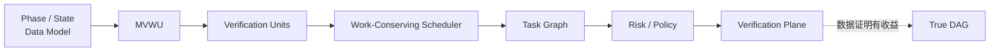

**不是：**

```text
P0-P8 → DAG
```

而是：

> **P0-P8 是生命周期协议；MVWU 是执行粒度；Task Graph 是依赖关系；Verification Graph 是证据关系；Scheduler 是资源调度器。**

这几个东西一旦拆开，Agateon 的架构会突然清晰很多。

---

# 1. v4 最重要的升级：从“DAG 收益”转向“MVWU”

v4 最值得注意的是这一条：

> 25 条批级 commit 已经系统性携带批级测试证据。缺的不是新机制，而是证据标准、消费 gate、批→测试映射声明。

这其实非常大。

因为这意味着：

**MVWU 不是凭空发明的。**

Agateon 已经有它的“野生形态”。

现在实际上已经存在：

```text
Batch
 ├── Work
 ├── Commit
 └── Test Evidence
```

只不过还没有把它正式定义成 protocol primitive。

所以真正应该做的不是：

> “设计一个全新的 MVWU 系统。”

而是：

> **把现有实践提升为协议。**

这非常符合 Agateon 一贯的演进方式：

> practice → evidence → invariant → protocol

---

# 2. 我现在会把 MVWU 定义得更严格

如果让我给它下定义：

> **MVWU = 一个具有明确输入边界、产出边界、验证契约和 provenance 的最小工作单元，并且其完成状态可以被机械验证。**

也就是至少要有：

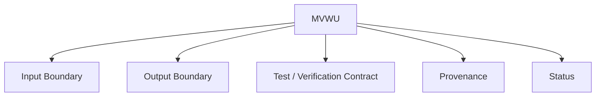

而不是简单：

> “这是一个 batch。”

---

# 3. 这一区别极其重要

现在：

```text
Batch A
Batch B
Batch C
```

只是**执行切分**。

未来：

```text
MVWU-A
MVWU-B
MVWU-C
```

是：

**执行 + 验证 + provenance 的完整单元。**

这才是可调度的东西。

---

# 4. 所以 Task Graph 应该建立在 MVWU 之上

我现在会把未来的数据模型想成：

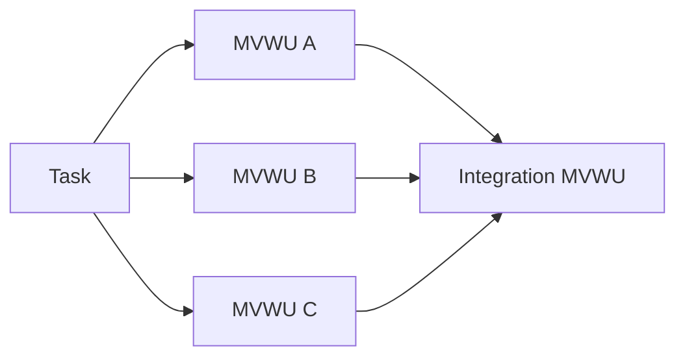

注意：

**不是把 P4/P5/P6 变成 DAG node。**

而是：

> **把“可验证工作单元”变成 graph node。**

这比 Phase DAG 干净得多。

---

# 5. Verification Graph 也就自然出现了

每一个 MVWU 都可以声明：

```text
MVWU
 ├── output
 ├── test evidence
 ├── static evidence
 ├── review evidence
 └── provenance
```

然后整个 Task 再有：

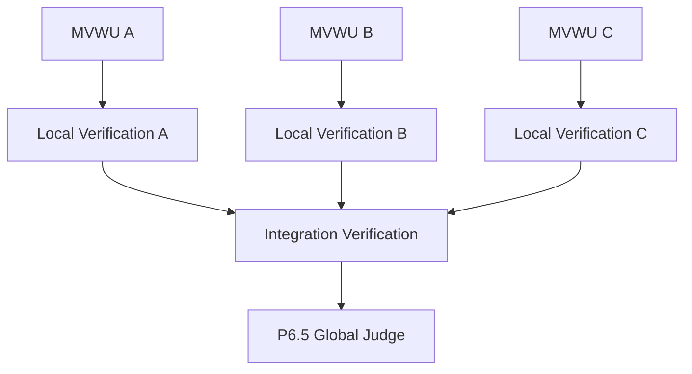

于是：

# Task Graph

回答：

> **工作依赖是什么？**

# Verification Graph

回答：

> **证据依赖是什么？**

这就是 v4 最重要的架构洞察之一。

---

# 6. 这比“DAG”本身高级很多

因为 DAG 只是：

> graph topology

而 Agateon 真正需要的是：

> **graph semantics**

例如：

```text
A → B
```

到底意味着：

* B 需要 A 的代码？
* B 需要 A 的接口？
* B 需要 A 的 test evidence？
* B 需要 A 的 commit？
* B 需要 A 的 judge verdict？
* B 只需要 A 的 artifact？

普通 DAG 并不能回答。

MVWU + typed edges 才能回答。

---

# 7. 我建议未来的 edge 也不要只是 `depends_on`

至少可以有：

| Edge              | 含义     |
| ----------------- | ------ |
| `artifact_dep`    | 依赖产物   |
| `interface_dep`   | 依赖接口   |
| `test_dep`        | 依赖验证结果 |
| `provenance_dep`  | 依赖可信历史 |
| `integration_dep` | 必须完成集成 |
| `approval_dep`    | 必须有人批准 |

这样：

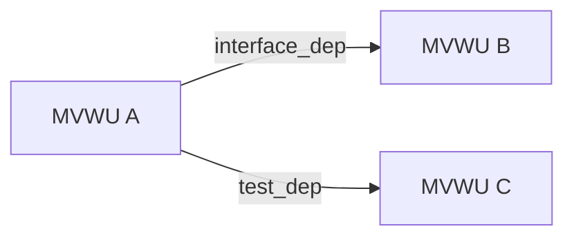

这才是一个真正适合 Agent Engineering 的 graph。

---

# 8. v4 对 DAG 的“P4 暂缓”我完全赞成

而且我认为甚至可以再激进一点：

## **不要把 True DAG 放进 roadmap 的普通 feature list。**

应该把它定义成：

> **Research Trigger**

即：

```text
if measurable_pipeline_elasticity > threshold:
    investigate DAG
else:
    do not implement DAG
```

原因是 v4 已经证明：

* 16 个多批次阶段确实存在高 CV；
* 但真实可流水收益被真依赖、P5 全量验证、P6.5 global judge 三重限制压缩；
* 当前枚举出的收益池只有 11/34；
* 两个完整重建案例的关键路径弹性都接近 0。

所以：

> **DAG 目前没有足够的 empirical justification。**

这比“我觉得 DAG 太复杂”强得多。

---

# 9. 但我会挑战 v4 一个地方：11/34 不应该成为长期判断依据

这个数字现在很好用。

但它不是一个稳定的产品指标。

因为一旦你把 MVWU 做起来：

```text
现在：
11/34 可流水

未来：
??? / ??? MVWU 可流水
```

分母已经变了。

所以未来应该从：

> **Task-level DAG opportunity**

转成：

# **MVWU-level pipeline elasticity**

例如定义：

$$
E_{pipeline}
=
\frac{T_{barrier}-T_{optimal}}
{T_{barrier}}
$$

然后按任务 / MVWU / project 统计。

---

# 10. 这会直接告诉你 DAG 什么时候值得做

例如：

| Project   | MVWU | Pipeline Elasticity |
| --------- | ---: | ------------------: |
| Agateon   |  250 |                  3% |
| Project A |  400 |                 28% |
| Project B |  120 |                  1% |
| Project C |  900 |                 46% |

那么答案非常简单：

> Agateon 不需要 DAG，但 Project C 需要。

这才是真正的：

# **adaptive orchestration**

---

# 11. 这会进一步改变 Agateon 的产品定位

以前：

> Agateon = 固定流程 orchestrator

未来：

> **Agateon = verification-aware adaptive orchestrator**

也就是说，它不是规定：

> “所有项目都必须这样跑。”

而是：

> “根据任务风险、工作单元、验证能力、依赖结构，决定应该怎样跑。”

这是更强的东西。

---

# 12. v4 对“活动遥测”的判断也很准确

73.8% 的时间落在长事件间隔里，这个数字很有意思，但报告自己已经正确提醒：

> 不能把它直接解释成人工等待。

我甚至建议以后 Agateon **不要再用 event gap 作为“Agent 是否工作”的 proxy**。

应该正式定义：

```text
Execution Time
Waiting Time
Verification Time
Human Time
Scheduler Time
Unknown Time
```

然后 event ledger 增加：

```text
execution_started
execution_heartbeat
execution_finished

human_wait_started
human_wait_finished

verification_started
verification_finished
```

---

# 13. 但这里有一个重要原则

不要让 telemetry 变成新的 authority。

这一点必须和 Agateon 现在的设计保持一致：

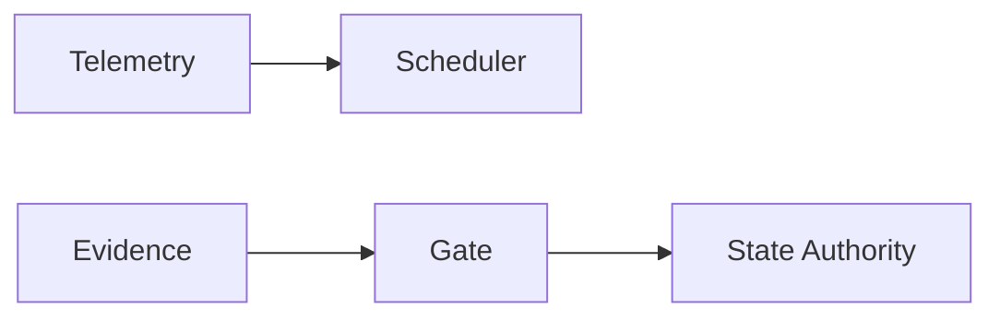

**Telemetry 是观测。**

不是：

> “agent_idle，所以 phase fail。”

否则你会把 observability 和 correctness 混在一起。

v4 的方向和 Agateon 现有 command-stream detection 思路是一致的：它应该是调度/调查输入，而不是状态权威。

---

# 14. v4 的 Phase extensibility 发现，我认为非常重要

这里我反而比报告更激进。

报告发现：

* role 已经有声明式扩展模式；
* phase 仍然被 schema enum 锁死；
* `check-gate.py` 有 10 个手写 gate；
* phase order 有 regex 数字假设；
* unknown phase 还有 fail-open 风险。

这说明 Agateon 有一个非常明显的架构债务：

# **Protocol data model 没有完全成为 source of truth。**

现在实际上：

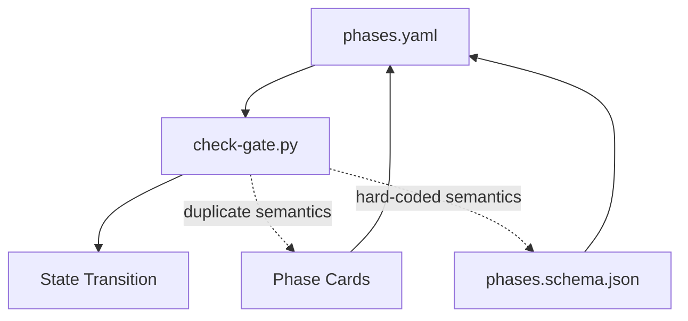

这不是 DAG 问题。

这是：

# **Declarative protocol vs imperative implementation drift**

的问题。

---

# 15. 所以我赞成把 Phase order 做成显式数据

例如未来：

```yaml
phases:
  - id: P0
    order: 0
    next: P1

  - id: P1
    order: 1
    next: P2

  - id: P2
    order: 2
    next: P3
```

但我会再加一个设计原则：

> **不要让 `order` 成为新的唯一真理。**

因为一旦真的支持 branch：

```text
P2
├── P3
├── P3-security
└── P3-migration
```

单纯 `order` 又会开始失效。

所以最好：

```yaml
phase:
  id: P3-security
  predecessors:
    - P2
  successors:
    - P4
```

然后：

```text
order
```

只是：

> presentation / topological hint

而不是 transition authority。

---

# 16. 这也是为什么我认为“Phase DAG”不是好方向

因为 phase 本身承担太多语义：

```text
phase
├── lifecycle
├── role
├── artifact
├── gate
├── retry
├── retreat
├── evidence
└── state
```

一旦让 phase graph 真 DAG：

**整个 protocol complexity 会爆炸。**

而 MVWU：

```text
MVWU
├── inputs
├── outputs
├── verification
├── provenance
└── dependencies
```

反而天然适合 graph。

所以：

# **Graph belongs below Phase, not inside Phase.**

这是我现在最强的架构判断。

---

# 17. 这也解释了为什么“任务级拆分”这么强

假设一个大任务：

```text
TAG0040
```

不要：

```text
P4-A
P4-B
P4-C
```

而是：

```text
TAG0040-A
TAG0040-B
TAG0040-C
```

每一个都是完整 Agateon task。

然后：

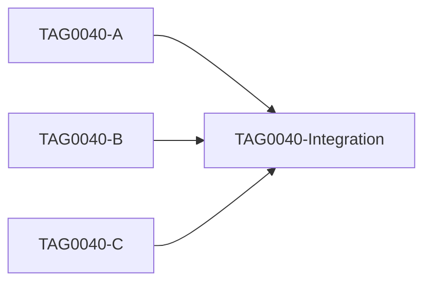

这其实已经是 DAG。

只是：

> **DAG 在 task 层，而不是 phase 层。**

这就是为什么我非常赞同 v4 的方向。

---

# 18. 我甚至认为 Agateon 的“最小任务”未来应该是 MVWU

这会带来一个漂亮的层级：

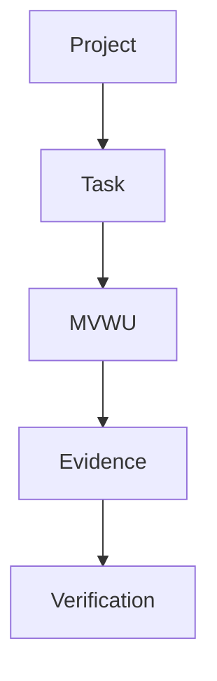

于是：

### Task

人类意图 / feature / change。

### MVWU

真正执行和调度的粒度。

### Evidence

证明它完成了。

### Gate

判断它是否可信。

这就非常干净。

---

# 19. 这会让 routing 也变得更聪明

现在 TAG0034：

```text
phase + role
→ tier
→ model
```

未来可以变成：

```text
MVWU
├── risk
├── complexity
├── verification_cost
├── latency
└── required_capability
        ↓
routing policy
        ↓
agent/model
```

例如：

```yaml
mwu:
  risk: high
  capability:
    - security
  verification:
    independent_judge: true
```

然后 routing 自动选择：

```text
deep model
+
fresh-context judge
+
strict evidence
```

而 typo：

```text
risk: low
```

则：

```text
cheap model
+
local test
```

这就是：

# **Risk-aware execution**

而不是单纯：

# **Model routing**

---

# 20. 于是我现在会把 Agateon 的核心模型重新写成这张图

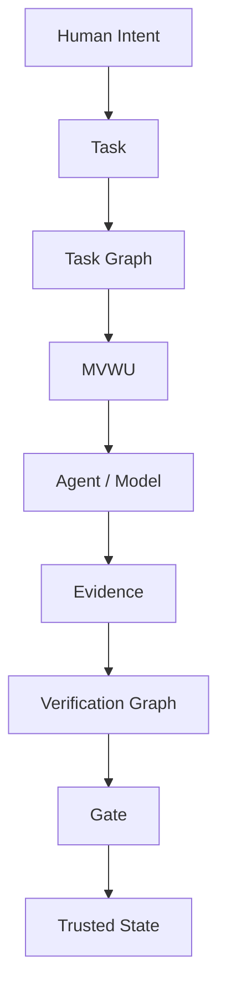

其中：

**Task Graph 决定工作怎么走。**

**Verification Graph 决定可信度怎么走。**

**State Machine 决定协议状态怎么走。**

这三个 graph / machine 不应该再混为一谈。

---

# 21. 这其实是 Agateon 和 OpenHands / Codex 最大的潜在差异

外部市场越来越容易出现：

```text
Agent
+
Orchestrator
+
Routing
+
Runtime
+
Observability
```

但：

> **Evidence semantics + verification semantics + state authority + provenance**

没有那么容易做。

尤其是 Agateon 已经有：

* P6 provenance
* P6.5 fresh judge
* event hash chain
* state transition validation
* dispatch-context integrity
* fail-closed philosophy

这些东西组合起来，才有可能形成：

# **Verification Plane**

这才是 moat。

---

# 22. 但是还有一个问题：MVWU 千万不要变成“新官僚主义”

这是我对下一阶段最大的提醒。

如果最后 MVWU 变成：

```yaml
mwu:
  id:
  owner:
  phase:
  package:
  dependencies:
  outputs:
  evidence:
  verification:
  provenance:
  risk:
  model:
  retry:
  ...
```

然后一个简单 bug 修复要填 30 个字段：

**Agateon 就死了。**

MVWU 必须遵循：

> **Minimal by default, explicit when risk requires it.**

例如：

```yaml
mwu:
  id: auth-token-parser
  output:
    - src/auth/token.py
  verify:
    - pytest tests/auth/test_token.py
```

这就足够。

高风险任务再增加：

```yaml
risk:
  level: high

verify:
  independent_judge: true
  provenance: strict
```

---

# 23. 所以我会给 MVWU 定四个 invariant

不是十几个字段。

### I1 — Boundary

> 能明确知道它改了什么。

### I2 — Verification

> 能明确知道什么证明它正确。

### I3 — Provenance

> 能明确知道证据对应哪个工作结果。

### I4 — Composability

> 多个 MVWU 可以组合成更大的 task。

如果满足这四个：

**它就是一个合格的 MVWU。**

---

# 24. v4 的下一步研究，我会这样重新排

报告现在建议：

> phase semantics → telemetry → scheduler → task decomposition → verification units → DAG。

我会稍微改：

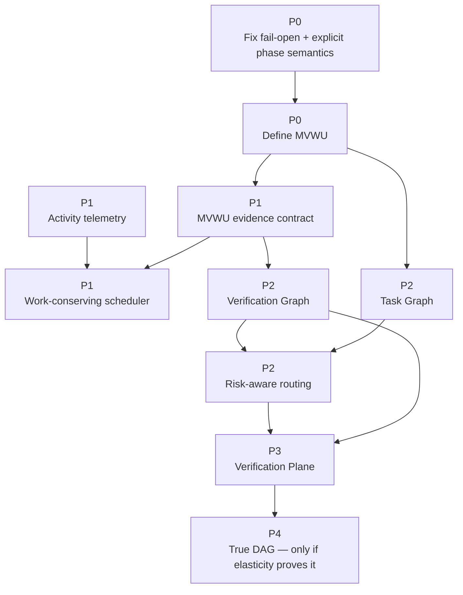

这里最关键的变化：

# **MVWU 提前到 P0/P1。**

因为它是后面所有东西的共同基础。

---

# 25. 最后说我对 v4 的总体评价

### v3：

> **“不要急着做 DAG。”**

### v4：

> **“我们已经开始知道为什么不用急着做 DAG，以及下一步真正应该构建什么。”**

这是质的提升。

尤其这几个发现已经形成了一个非常完整的理论链：

```text
高 batch variance
        ↓
不等于
        ↓
可流水
        ↓
因为有真实依赖
        +
全量验证
        +
global judge
        ↓
所以 DAG elasticity 很低
        ↓
但是现有 batch 已经携带验证证据
        ↓
因此存在 MVWU 雏形
        ↓
把它制度化
        ↓
才能真正获得可验证并行性
        ↓
如果 elasticity 最终仍高
        ↓
再做 DAG
```

这条逻辑我认为**已经成立了**。

---

# 我的最终判断

如果把 Agateon 的未来浓缩成一句话，我现在不会再说：

> **“Agateon 是 Agent Control Plane。”**

也不会说：

> **“Agateon 应该做 DAG。”**

我会说：

# **Agateon 应该成为 Agent Engineering 的 Verification Plane，而 MVWU 是它的基本原子。**

然后：

```text
MVWU
  ↓
Verification
  ↓
Trusted State
  ↓
Task Graph
  ↓
Adaptive Scheduling
  ↓
Risk-aware Agents
```

**DAG 只是最后可能出现的一种优化实现，而不是产品/协议本身。**

这比我看 v3 时的判断又更进一步了。

而且我认为 **v4 已经足够作为 Agateon 下一轮架构设计的“研究基线”**。下一件最值得做的，不是再写一篇 DAG 分析，而是直接写一份：

> **《Agateon MVWU Protocol — Design & Invariants》**

把 **MVWU、Task Graph、Verification Graph、Evidence Contract、Provenance、Scheduler** 六者的边界一次定义清楚。

一旦这个文档成立，后面很多现在看起来互相独立的 TAG——routing、command stream、P5 evidence、P6 provenance、P6.5 judge、task decomposition、work-conserving scheduler——会开始汇聚成一个统一架构。
