我看完了。**这份 v3 分析，我基本赞同，而且它确实让我对 Agateon 的下一步判断发生了一个重要变化：**

> **现在不应该做“真 DAG”。**
>
> 更准确地说：**不要为了 DAG 而 DAG；应该先把 Agateon 从“阶段编排器”升级成“可验证的工作保持调度器（work-conserving orchestrator）”。**

这份报告最有价值的地方，不是它证明了 DAG 不值得做，而是它把一个很容易陷入架构幻想的问题，变成了一个**可以用证据回答的经济问题**。

---

# 1. 我先给这份报告打分

| 维度              |                我的评价 |
| --------------- | ------------------: |
| 数据意识            |               ★★★★★ |
| 对 Agateon 内核的理解 |               ★★★★★ |
| 对 DAG 的批判       |               ★★★★★ |
| 反证意识            |               ★★★★★ |
| 工程成本分析          |               ★★★★☆ |
| 统计严谨性           |               ★★★★☆ |
| 对未来架构的指导价值      |               ★★★★★ |
| 最大不足            | **还可以进一步测“真实可流水性”** |

整体我会给：

# **9/10**

而且它不是“DAG 不好”的论证。

它真正证明的是：

> **当前 Agateon 的瓶颈并不等价于 phase barrier。**

这是非常重要的区别。

---

# 2. 最重要的结论：报告推翻了一个很诱人的直觉

之前很容易形成这样的思路：

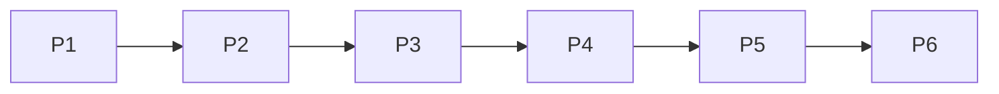

然后想：

> “既然 Agent 已经可以并行，那为什么不把它改成 DAG？”

直觉上非常合理。

但报告用数据把它拆开了：

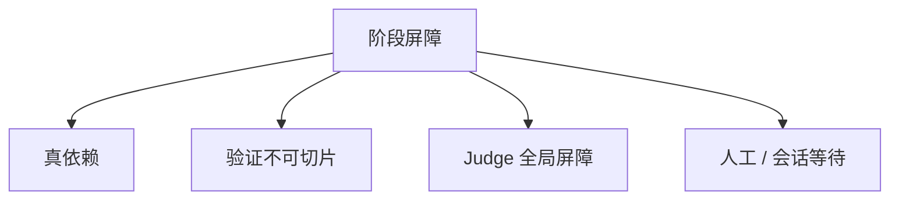

**真正的问题不是“屏障存在”。**

而是：

> 屏障后面有没有一个可以安全提前启动、并且可以独立验证的工作单元？

如果没有：

**把状态机改成 DAG 只是把复杂度从一个地方搬到另一个地方。**

---

# 3. 这份报告最漂亮的一个结论：异构 ≠ 可流水

这是全文我最喜欢的一点。

报告发现：

> 16 个多批次阶段的 CV 中位数 0.81，81% 的阶段 CV > 0.5。

也就是说：

**任务之间 / batch 之间确实非常不均匀。**

但是：

> **时间差不等于可以流水。**

TAG0034：

> P4a 410 min vs P4b 24 min

乍看：

> “这不就是 DAG 的黄金机会吗？”

结果调查发现：

> `serial: true`

也就是：

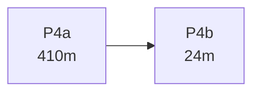

不是：

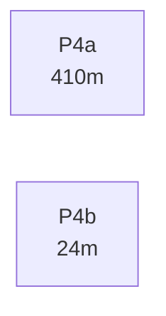

而是：

> B 依赖 A。

这非常关键。

所以真正应该测的是：

# **Critical-path elasticity**

而不是：

# **Batch duration variance**

这是我认为这份报告下一版还可以继续加强的地方。

---

# 4. 我会把 DAG 的真正收益公式再改一层

报告现在有：

> 收益上限 = `Σ max_tracks(w) − max_tracks Σ_phases(w)`

数学上没问题。

但工程上还差一个东西：

> **可切片性 / 可验证性。**

所以我会把真实收益写成：

$$
DAG\_ROI
=
T_{barrier}
-
T_{pipeline}
-
C_{merge}
-
C_{invalidations}
-
C_{coordination}
$$

而：

$$
T_{pipeline}
$$

只有在下面这些条件同时成立时才明显下降：

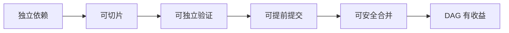

任何一个环节断掉：

**理论 DAG speedup 都会坍缩。**

这比单纯分析阶段耗时更接近真实工程收益。

---

# 5. 我尤其赞同报告对 P5 的判断

这是一个很容易被忽略的问题。

假设：

```text
slice A → P4
slice B → P4
slice C → P4
```

然后：

```text
A → P5
B → P5
C → P5
```

看起来非常漂亮。

但是现在 P5 是：

> **全量测试套件。**

那么实际上：

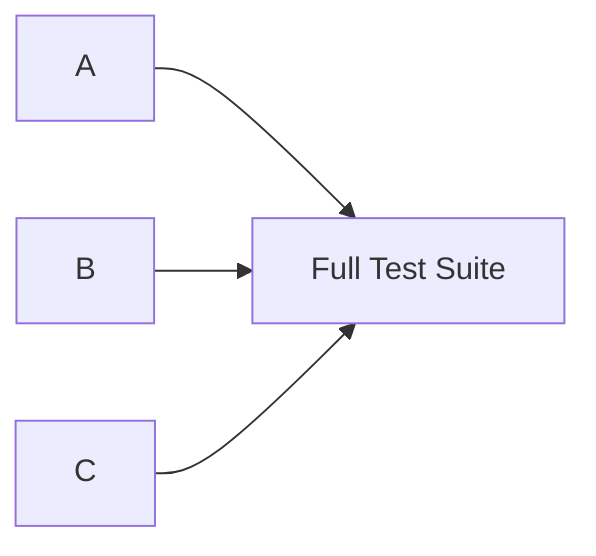

你并没有得到真正的：

```text
A → Test A
B → Test B
C → Test C
```

而是：

> A/B/C 都在争夺同一个 global verification resource。

所以报告的这个结论非常准确：

> **收益瓶颈不是“没有切片”，而是“没有可流水的验证单元”。** 

这其实比“不要做 DAG”重要得多。

---

# 6. P6.5 更是一个天然的“终点屏障”

这个设计本身是对的。

因为 P6.5 的价值恰恰来自：

> fresh context + 全部 BDD + independent judgment。

如果把它切成：

```text
slice A judge
slice B judge
slice C judge
```

你会失去一部分它真正想验证的东西：

> **系统整体是否满足 acceptance contract？**

所以我完全同意报告：

> **P6.5 本质上是 global barrier。**

也就是说未来即使做 DAG：

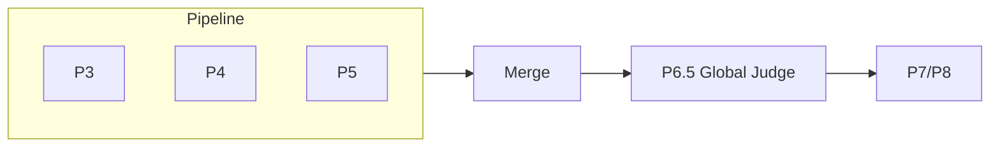

**也不会变成“整个 P0–P8 都是 DAG”。**

最多是：

> **中段 pipeline + 尾部 global verification**

这是非常不同的架构。

---

# 7. 所以报告其实发现了一个更好的未来架构

我认为它没有把这个结论完全说透。

未来 Agateon 最合理的形态可能不是：

> **DAG Orchestrator**

而是：

# **Barrier + Work-Conserving Pipeline**

也就是：

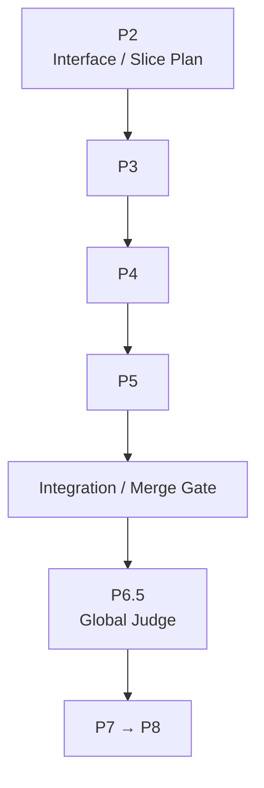

但与此同时：

```text
P4-A finished
        ↓
slot available
        ↓
run another independent unit
```

也就是说：

> **不是让 phase graph 无限 DAG 化，而是让 scheduler 在 barrier 内部尽可能 work-conserving。**

这成本低得多。

---

# 8. 因此我非常赞同 Path C

报告提出：

> 工作保持调度。

我甚至认为：

# **这是 Agateon 下一阶段最应该做的事情。**

因为它不需要：

* 改 `.state.yaml`
* 改 phase schema
* 改 gate semantics
* 改 event hash chain
* 改 P6.5
* 改历史任务
* 引入 track identity
* 引入 merge semantics

但它可以直接解决：

> **“一个 Agent 空着，另一个 Agent 还在干活，我为什么不能继续派活？”**

这是实打实的吞吐优化。

---

# 9. Path B 其实比报告说的还重要

报告：

> 任务级拆分 + 集成任务，是 DAG 的廉价等价物。

我认为这个判断**非常强**。

因为：

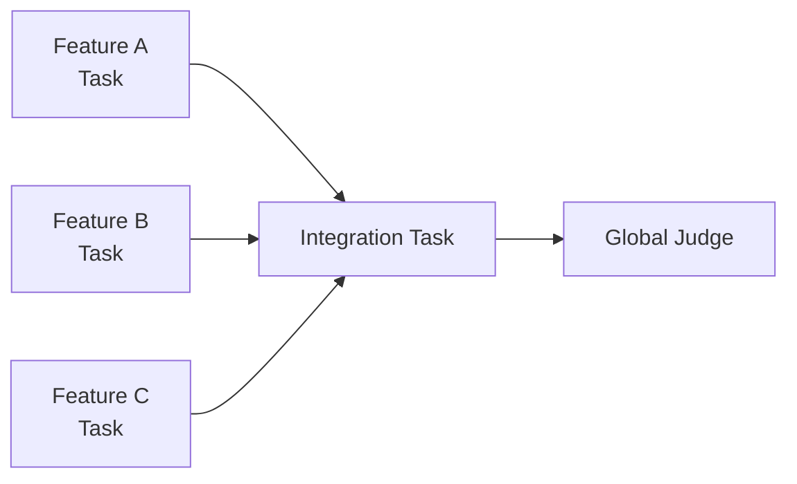

每个 task 都可以拥有完整：

```text
P0 → P1 → ... → P8
```

于是：

**不用改变 Agateon 的基本状态模型。**

你实际上获得了 DAG 的很多收益。

这是一种非常漂亮的：

> **protocol-level decomposition instead of state-machine-level decomposition**

---

# 10. 这也是我对 Agateon 未来的一个重要修正

之前我说：

> Agateon 未来可能走向 Agent Control Plane。

我现在会进一步限定：

## 不要让 Control Plane 的核心抽象变成 DAG。

应该是：

# **Task Graph + Verification Graph**

而不是：

# **Phase DAG**

区别很大。

---

# 11. 我认为 Agateon 最终应该有两张图

这是看完这份报告后，我认为非常值得明确的架构方向。

### 第一张：Task Graph

描述：

> **什么工作可以并行？**

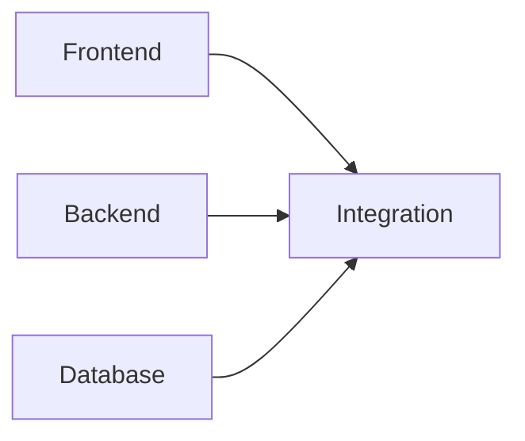

### 第二张：Verification Graph

描述：

> **什么证据必须经过什么验证？**

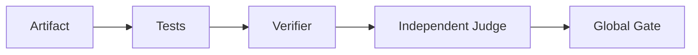

这两张图**不要混成一个 graph**。

这是我从报告里得到的一个非常强的架构结论。

---

# 12. 而现在 Agateon 把两件事情部分耦合了

目前：

```text
phase
 ↓
gate
 ↓
state transition
```

因此 phase 同时承担：

* workflow semantics
* execution ordering
* verification boundary
* state authority

这在单任务时代非常好。

但未来规模起来以后：

> **Execution graph 和 verification graph 应该逐渐正交。**

这可能比“做 DAG”本身更值得研究。

---

# 13. 报告发现的“阶段可扩展性”问题，我反而认为是现在应该马上修的

这一点和 DAG 无关。

尤其这个：

> 非数字阶段名导致回退检测静默失效。

以及：

> unknown phase → gate fail-open。

如果报告的代码定位准确，那么这属于：

# **现在就应该修，而不是等未来。**

原因很简单：

DAG 可以不做。

但：

> **fail-open 的 state machine 永远不能接受。**

---

# 14. 尤其是这个 bug class

现在类似：

```text
phase = "p-alpha"
```

然后代码：

```text
re.search("[0-9]+", phase)
```

如果没拿到数字，就可能得到：

```text
None
```

再走错误路径。

这不是：

> “未来扩展性不好。”

而是：

> **协议的 correctness boundary 依赖命名约定。**

这应该立即变成：

```yaml
phases:
  - id: P0
    order: 0
  - id: P1
    order: 1
```

然后所有 transition logic：

```text
phase_id
→ phases.yaml
→ order
→ predecessors
→ successors
```

而不是：

```text
phase string
→ regex
→ 猜数字
```

---

# 15. 我甚至认为这比 DAG 更有价值

因为它会给未来留下一个非常好的基础：

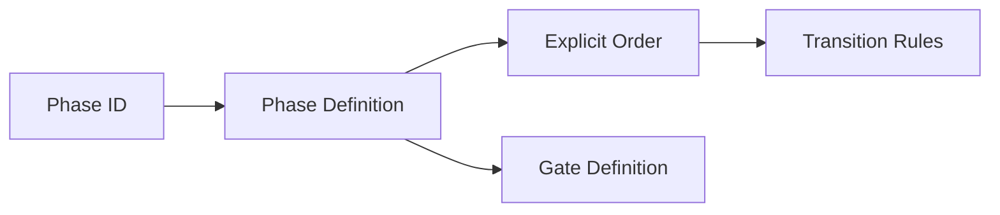

以后如果真的需要：

```text
P-alpha
P-security
P-review
```

至少不会因为 regex 而炸。

---

# 16. 但这里有一个我想反驳报告的小地方

报告认为：

> 阶段集可扩展与 DAG 是正交议题。

**大方向对。**

但从架构演进角度看，它们其实有一个很深的共同点：

> **都在要求 Agateon 把“phase”从代码中的特殊枚举，升级成一等数据模型。**

所以：

```text
显式 phase order
```

其实是未来：

```text
phase set
task graph
verification graph
```

共同的基础设施。

所以我会把它排得比报告还高：

### P0 priority

**Phase semantics → data model**

而不是：

**DAG → data model**

---

# 17. 这份报告还有一个特别重要的发现：73.8%

这个数字我会非常谨慎地看。

报告自己已经非常诚实地说明：

> event stream 不能知道 agent 是否真的在工作。

所以：

> 73.8% ≠ 73.8% 人工等待。

这是正确的。

它只能说明：

> **73.8% 的 elapsed time 位于长 event gap 中。**

这两个概念必须保持严格区分。

---

# 18. 所以下一步最值得做的不是 DAG POC

而是：

# **Activity Telemetry**

我会加几个非常轻量的事件：

```text
dispatch_started
dispatch_finished
agent_active
agent_idle
human_wait
gate_started
gate_finished
```

甚至不需要非常复杂。

目标是回答：

```text
Elapsed
 ├── Agent compute
 ├── Tool execution
 ├── Gate execution
 ├── Human waiting
 ├── Scheduler waiting
 └── Unknown
```

然后再决定：

> DAG / work-conserving / task decomposition 到底优化哪个桶。

---

# 19. 如果测出来……

### 情况 A

```text
Agent compute 70%
Human wait 10%
Scheduler wait 20%
```

那 DAG 有价值。

### 情况 B

```text
Agent compute 20%
Human wait 65%
Scheduler wait 15%
```

那做 DAG 基本是错方向。

### 情况 C

```text
Agent compute 30%
Scheduler wait 50%
Human wait 20%
```

那 Path C 几乎就是直接命中。

---

# 20. 所以这份报告实际上给 Agateon 指出了一个非常好的研发优先级

我会重新排：

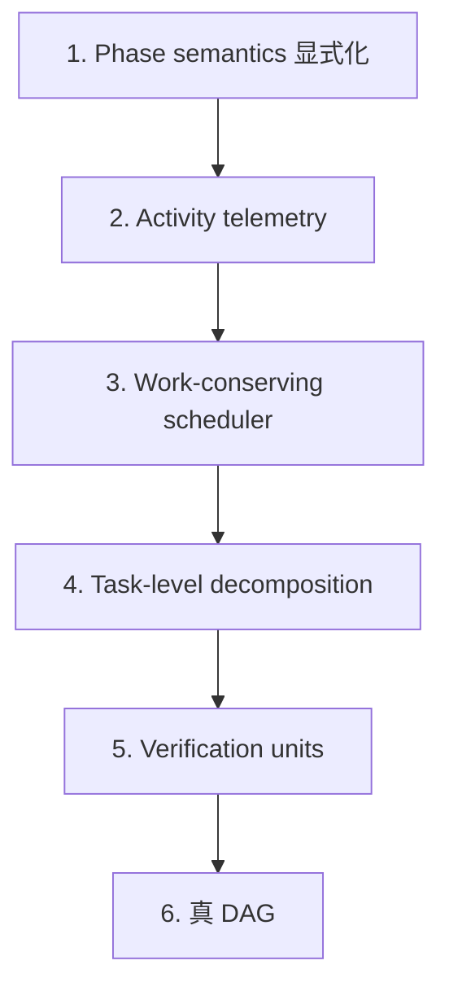

而不是：

```text
现在 → DAG
```

---

# 21. 最关键的是第 5 步：Verification Units

我认为这是这份报告真正挖出来的“隐藏宝藏”。

如果未来真的想让 Agateon 流水化：

> **首先应该把 P5 从“全局验证”拆出一层“局部验证单元”。**

比如：

```text
slice A
 ├── unit tests A
 ├── contract tests A
 └── static checks A

slice B
 ├── unit tests B
 ├── contract tests B
 └── static checks B

            ↓

      Integration Test

            ↓

       Full Suite

            ↓

      P6.5 Judge
```

这才是真正的 pipeline。

---

# 22. 于是 Agateon 的未来架构会变得很漂亮

不是：

> DAG everything.

而是：

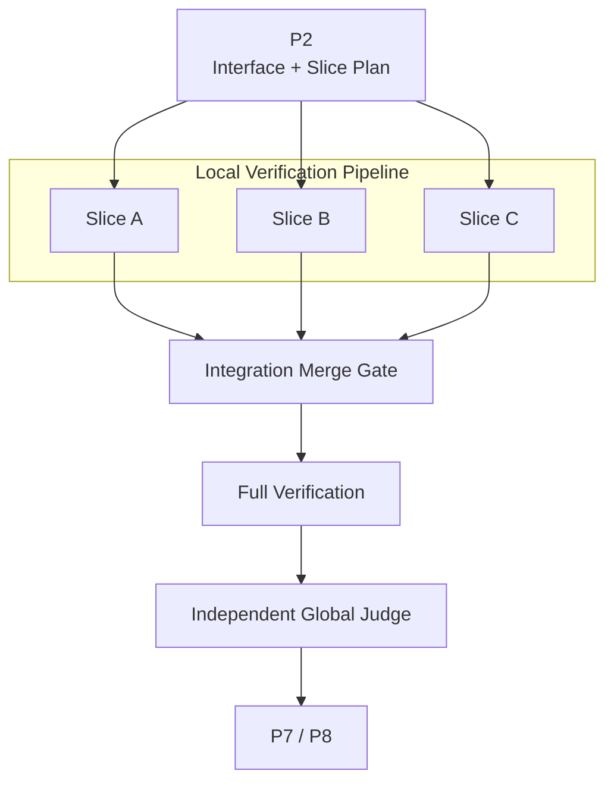

这比“P0-P8 全 DAG”健康得多。

---

# 23. 关于这份报告本身，我建议再加三个东西

如果你准备把它作为 Agateon 的正式 architecture research，我会建议 v4 增加：

### ① Critical-path reconstruction

不要只统计 batch duration。

构造：

```text
dependency edge
+
actual commit order
+
declared serial constraints
+
file overlap
+
interface dependency
```

最后算：

> 如果取消 barrier，理论 critical path 到底减少多少？

---

### ② Counterfactual simulation

拿现有 34 个任务，模拟：

```text
Current
vs
Work-conserving
vs
Task decomposition
vs
True DAG
```

输出：

| Strategy        | Median |  P90 | Throughput | Complexity |
| --------------- | -----: | ---: | ---------: | ---------: |
| Current         |   100% | 100% |       100% |         1x |
| Work-conserving |      ? |    ? |          ? |       1.1x |
| Task split      |      ? |    ? |          ? |       1.3x |
| True DAG        |      ? |    ? |          ? |       4–8x |

这样“不要做 DAG”就从 architecture opinion 变成：

> **counterfactual evidence**

---

### ③ Verification-unit inventory

统计：

```text
P3 local verification
P4 local verification
P5 local verification
integration verification
global verification
```

最后得到：

> **Agateon 当前到底有多少“可流水验证单元”？**

这个数字可能比 11/34 更重要。

---

# 24. 最后，我会修正我上一条回答里的一个观点

我上一条说：

> Agateon 未来应该成为 Agent Governance / Control Plane。

现在看这份报告后，我会说得更精确：

# **Agateon 不应该首先成为 Agent Control Plane。**

因为：

* OpenHands 在往这个方向走。
* Codex 在往这个方向走。
* Devin 在往这个方向走。
* 各家云厂商都会做 routing / fleet / budget / observability。

真正不容易被复制的应该是：

# **Agent Verification Plane**

也就是：

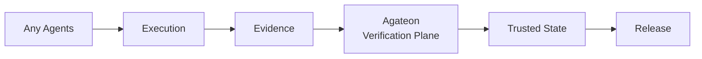

**Control Plane 可以是产品功能。**

**Verification Plane 才应该是 Agateon 的 protocol moat。**

---

# 我的最终判断

这份 v3 报告实际上让我对 Agateon 的未来更乐观，而不是更悲观。

因为它证明了一件很重要的事：

> **Agateon 目前真正缺的不是“更先进的编排算法”，而是“把验证单元、任务拆分、调度和证据进一步产品化”。**

所以我现在会把路线定成：

| 优先级    | 方向                             | 判断                 |
| ------ | ------------------------------ | ------------------ |
| **P0** | 修 phase 显式 order / fail-closed | **现在就做**           |
| **P0** | Agent activity telemetry       | **现在就做**           |
| **P1** | Work-conserving scheduling     | **高 ROI**          |
| **P1** | Task-level decomposition       | **高 ROI**          |
| **P1** | Local verification units       | **战略级**            |
| **P2** | Risk-adaptive governance       | **产品核心**           |
| **P2** | Policy-as-code                 | **产品核心**           |
| **P3** | Verification Plane API         | **生态核心**           |
| **P4** | True DAG                       | **暂缓，除非数据证明收益池扩大** |

一句话总结这份报告：

> **它不是证明“Agateon 不需要 DAG”，而是证明“Agateon 下一阶段应该先解决可验证的并行性，而不是不可验证的并行性”。**

我认为这是目前对 Agateon 架构演进**非常成熟的一次刹车**。

而且如果让我从这份报告继续往下推，我现在最想研究的已经不是 **“DAG 怎么实现”**，而是一个更底层的问题：

> **“什么才是 Agateon 世界里的最小可验证工作单元（Minimum Verifiable Work Unit, MVWU）？”**

一旦这个东西定义出来，**task decomposition、work-conserving scheduling、local P5、DAG、risk policy、agent routing 其实会突然统一起来。**

这可能才是 Agateon 下一阶段真正的核心抽象。
