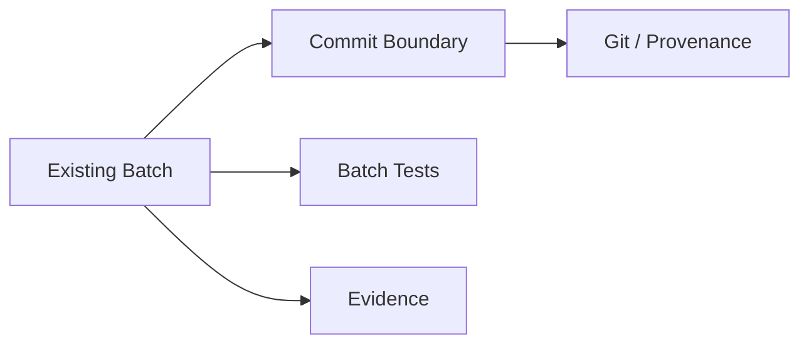
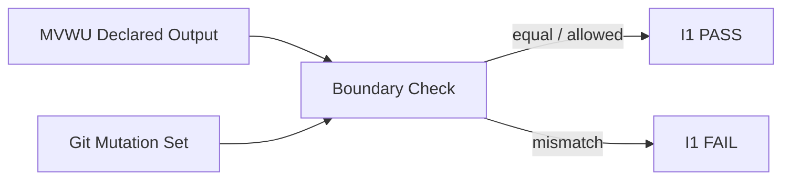
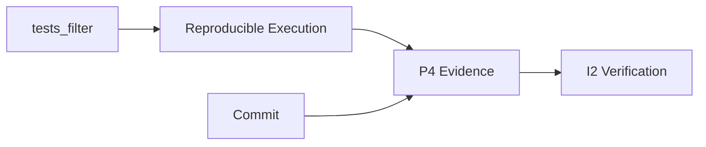
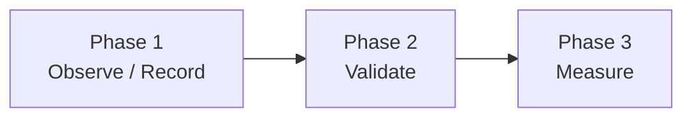
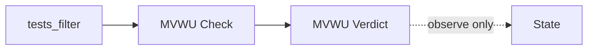
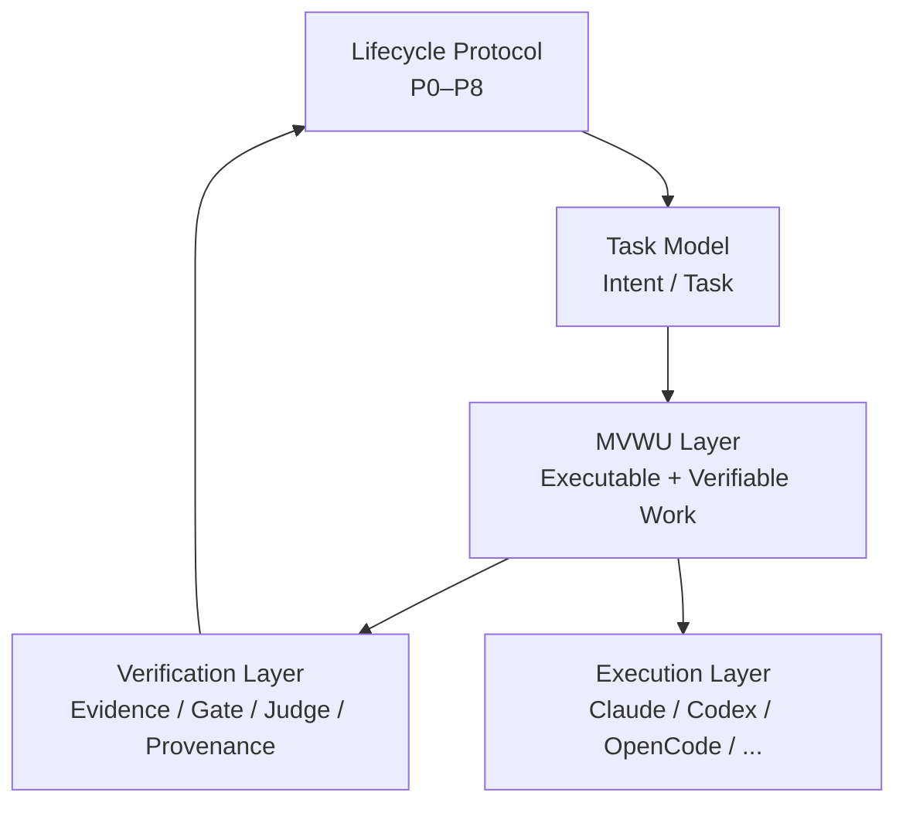
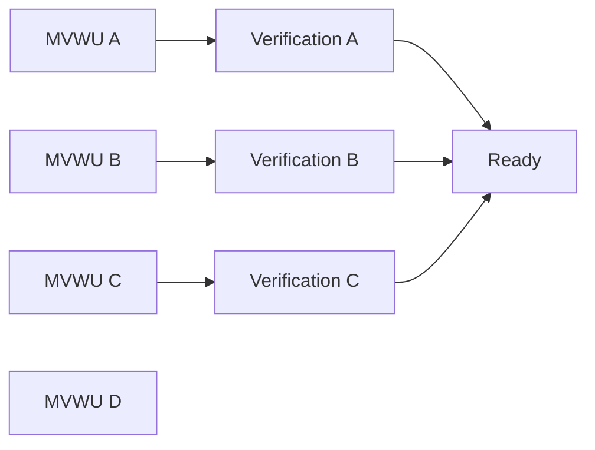
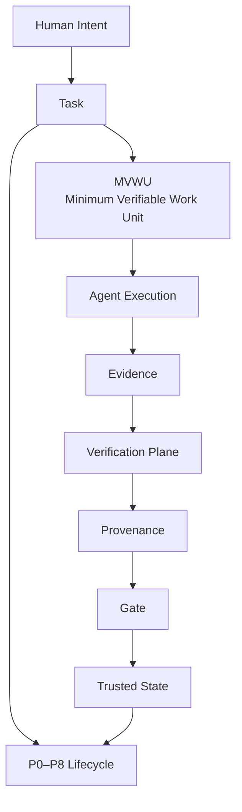

看了 v5。**这一版我认为已经从“架构分析”进入了“协议设计的第一版可落地规格”阶段。**

而且有一个明显变化：**v5 不再只是告诉我们“不该做 DAG”，而是给出了一个足够小、足够克制、又能和现有 Agateon 对接的替代抽象——MVWU。** 文档明确把现有 batch 实践升格为 MVWU，并把 Boundary / Verification / Provenance / Composability 四个不变量、字段预算、消费点和三阶段实施路径固定下来。

我现在的判断是：

# **这版方向基本正确，但我不会直接批准它进入协议实现。**

不是因为设计错，而是因为有 **3 个地方必须再钉死**：

1. **MVWU 的 I1 Boundary 还不够强**
2. **`tests_filter` 的验证语义仍然偏弱**
3. **“batch = MVWU”的 1:1 假设需要通过试点证明，而不是协议先验规定**

这三个问题解决后，我会认为 MVWU 可以成为 Agateon 下一代真正的一等 primitive。

---

# 一、先说 v5 最成功的地方

我非常赞同这个原则：

> **MVWU 不是新建一个 subsystem，而是把已经存在的 batch 实践正式化。**

这是非常 Agateon 的做法。

现在事实是：



v5 做的事情不是再造一个：

```text
MVWU Engine
MVWU Scheduler
MVWU Runtime
MVWU Database
```

而是：

> **把已有事实提炼成协议不变量。**

这和 Agateon 自己的 `practice → evidence → invariant → protocol` 演进哲学完全一致。

---

# 二、四个 invariant，我认为基本成立

v5：

| Invariant        | 核心问题          |
| ---------------- | ------------- |
| I1 Boundary      | 我到底改了什么？      |
| I2 Verification  | 什么证明我做对了？     |
| I3 Provenance    | 证据对应哪个结果？     |
| I4 Composability | 能不能和其他工作单元组合？ |

这个组合很好。

尤其是：

> **Composability 不等于 DAG。**

这点非常重要。

MVWU 可以先：

```text
A
B
C
 ↓
Integration
```

而不需要立即拥有：

```text
arbitrary DAG scheduler
```

所以：

**MVWU 是 graph-compatible primitive，而不是 graph implementation。**

这是一个非常健康的抽象边界。

---

# 三、我尤其赞成这个字段预算

v5 定义：

> `id + complexity` 两个既有强制字段，新字段最多三个，因此显式 MVWU ≤5 fields。

这其实是非常聪明的设计。

因为 Agateon 最大的风险之一就是：

> **把 governance 做成 paperwork。**

如果 MVWU 最后长成：

```yaml
id:
complexity:
output:
input:
deps:
tests:
tests_filter:
risk:
owner:
model:
agent:
timeout:
rollback:
evidence:
provenance:
...
```

那它会变成 enterprise process theater。

而现在：

```yaml
id
complexity
tests_filter?
output?
risk?
```

非常克制。

---

# 四、但是这里出现了第一个真正的问题

## `output` 不是 Boundary 的充分定义

v5 的 I1 是：

> 能明确知道它改了什么。

然后建议：

```yaml
output:
  - src/auth/token.py
```

这是有用的。

但它不能完全等价于：

> “这就是这个 MVWU 改动的边界。”

因为 Agent 可能：

```text
声明 output:
src/auth/token.py

实际修改:
src/auth/token.py
tests/auth/test_token.py
docs/auth.md
```

或者更危险：

```text
声明 output:
src/auth/token.py

实际修改:
src/auth/token.py
config/production.yaml
```

所以 I1 真正应该是：

# **Declared Boundary ⊇ Actual Mutation**

还是：

# **Declared Boundary = Actual Mutation**

必须明确。

我强烈建议选择第二种：

> **对于高风险显式 MVWU，声明边界与实际 mutation set 必须机械一致，或者声明允许的附带文件类别。**

否则 `output` 只是一个 hint。

---

# 五、所以 I1 最终应该有一个机械关系

我建议：



例如：

```text
Declared:
src/auth/token.py
tests/auth/test_token.py

Actual:
src/auth/token.py
tests/auth/test_token.py
```

PASS。

但：

```text
Declared:
src/auth/token.py

Actual:
src/auth/token.py
config/prod.yaml
```

FAIL。

这才叫：

> **Boundary is mechanically verifiable.**

否则 I1 会比 I2/I3 弱很多。

---

# 六、第二个问题：`tests_filter` 很重要，但现在定义还不够严格

v5：

```yaml
tests_filter: "pytest tests/auth/test_token.py"
```

然后：

```text
tests_filter exit 0
```

作为批级验证。

这个方向对。

但我认为：

# **一个 shell string 不应该直接成为 Verification Contract。**

因为：

```yaml
tests_filter: "pytest tests/foo.py"
```

只告诉我们：

> 跑了什么。

它没有告诉我们：

> 为什么这个测试足以证明这个 MVWU？

---

# 七、不过我也不建议现在增加更多字段

这正好和你的字段预算发生冲突。

所以我不会建议：

```yaml
tests:
  - command:
  - rationale:
  - scope:
  - expected:
```

太重。

更好的办法是：

> **把 `tests_filter` 定义成“可执行 verification selector”，而不是完整 verification proof。**

也就是说：

```text
tests_filter
    ↓
test execution
    ↓
exit code + stdout/stderr + timestamp + git HEAD
    ↓
P4-evidence/{batch}.log
```

最终真正的 I2 是：



这样就对了。

---

# 八、尤其要把“测试命令”和“测试证据”严格分开

这是 v5 最值得强化的一点。

### `tests_filter`

是：

> **如何验证**

### `P4-evidence/{batch}.log`

是：

> **验证实际发生过什么**

### Git

是：

> **验证针对哪个工作结果发生**

### Gate

是：

> **验证这些东西是否满足协议**

这四者不能混。

---

# 九、第三个问题更重要：I3 目前其实比 MVWU 本身成熟得多

v5 很诚实地说：

> `check-p6-provenance.py` 的七道审计已经成熟，但目前是任务级，没有下沉到 batch/MVWU。

我赞成：

# **现在不要急着下沉。**

这是一个非常好的克制。

因为很多 protocol design 很容易犯：

> “Task 有 provenance → MVWU 也必须完全复制一套 provenance。”

然后：

```text
Task provenance
MVWU provenance
Batch provenance
Agent provenance
Test provenance
```

最后审计系统爆炸。

现在应该：

```text
Task
  ↓
成熟 provenance

MVWU
  ↓
最小 evidence linkage

未来数据证明需要
  ↓
再下沉 provenance
```

这非常合理。

---

# 十、我甚至建议 I3 暂时重新定义成“可追溯”，而不是“完整 provenance”

即：

> MVWU 不需要拥有一套独立 provenance system。

只需要能回答：

```text
这个 evidence
    ↓
来自哪个 execution
    ↓
针对哪个 commit
    ↓
属于哪个 MVWU
```

即可。

这就是：

# **provenance linkage**

而不是：

# **provenance duplication**

---

# 十一、v5 最大的一个优点：它把“阶段 1 零内核改动”说清楚了

这部分我非常赞同。

v5 明确区分：

### Phase 1

```text
tests_filter
+
P4-evidence/{batch}.log
+
independent check
```

不进入：

* `.state.yaml`
* gate
* hook
* event authority

所以：

> **不是 protocol state machine modification。**

然后 Phase 2：

> 批级 gate

才真正进入：

```text
check-gate.py
```

这一区分非常专业。

---

# 十二、这其实体现了一个非常好的原则

# **Observe → Validate → Enforce**

而不是：

```text
Design
 ↓
Enforce
```

具体：



如果 Phase 1 数据发现：

> batch evidence 根本不稳定

那么直接停。

如果发现：

> 90% batch 都可以稳定验证

才值得进入 Phase 2。

这非常符合 Agateon 自身的演进方法。

---

# 十三、但是我会修改 Phase 1 的一个地方

v5 说：

> `tests_filter` 非零时，Phase 1 记录但不阻断。

我理解原因。

但这里有一个隐患：

如果你记录：

```text
expected_red
```

然后继续 commit，

很快会出现：

```text
P4-evidence:
PASS
PASS
FAIL expected
PASS
```

最后：

> “这个 MVWU 到底完成了吗？”

所以我建议：

## Phase 1 不阻断可以。

但 **check 必须给出机器可见的 verdict**。

例如：

```text
MVWU_RESULT: PASS
MVWU_RESULT: FAIL
MVWU_RESULT: EXPECTED_RED
MVWU_RESULT: UNKNOWN
```

但：

> **不要让这个结果改变 `.state.yaml`。**

这样：



这会给 Phase 2 留下非常好的数据基础。

---

# 十四、`UNKNOWN` 很重要

我会强烈建议不要只有：

```text
PASS
FAIL
```

还要：

```text
UNKNOWN
```

例如：

* command 不存在
* test selector 解析不了
* evidence log 损坏
* git boundary 不明确
* command timeout
* output path 不安全

根据 Agateon 的 fail-closed 哲学：

> **UNKNOWN ≠ PASS**

而且：

> Phase 1 可以不阻断，但必须记录 UNKNOWN。

Phase 2：

> UNKNOWN → block

这非常自然。

---

# 十五、v5 里这个细节我特别喜欢：P4-evidence 不进入 P6.5 judge

这是正确的。

否则会破坏 P6.5 的信息隔离。

现在：

```text id="lybr6q"
P4-evidence
      ↓
P5
      ↓
P6
      ↓
P6.5 judge
```

但 Judge 不直接吃：

```text
P4-evidence
```

这避免：

> implementer 自己提供的批级解释直接污染 fresh-context judge。

非常好。

---

# 十六、不过未来可以让 Judge 验证“结果”，而不是读取“过程”

这是我认为一个很漂亮的未来边界。

P6.5 不需要知道：

> “P4a 当时跑了 pytest X。”

它应该只需要知道：

> **最终 acceptance criteria 是否成立。**

所以：

```text
P4 MVWU evidence
    ↓
P5/P6 aggregation
    ↓
Acceptance evidence
    ↓
P6.5
```

而不是：

```text
P4 evidence
    ↓
P6.5
```

这样 fresh-context 的信任边界仍然成立。

---

# 十七、v5 对 `deps` 暂缓，我完全赞成

这一点非常重要。

现在不要加：

```yaml
deps:
  - foo
  - bar
```

因为一旦出现：

```text
MVWU A depends on B
```

你马上需要回答：

* dependency 是 artifact dependency？
* interface dependency？
* test dependency？
* execution dependency？
* provenance dependency？
* cross-task？
* same-task？
* cyclic dependency 怎么办？
* dependency failed 怎么传播？
* retry 怎么传播？
* partial completion 怎么办？

**一个 `deps` 字段就能打开半个 DAG 地狱。**

所以：

> **不加是对的。**

---

# 十八、我甚至会把 `deps` 从“未决问题”升级成“明确禁止，直到 research trigger”

也就是：

> Phase 1/2 不允许 `deps`。

只有：

```text
MVWU-level E_pipeline
+
dependency demand
+
multi-task evidence
```

达到阈值后才研究：

> typed dependency model

这样可以保护 protocol 不被提前污染。

---

# 十九、关于 `risk`，我也建议稍微克制

现在：

```yaml
risk: high
```

看起来很自然。

但风险是谁算的？

如果：

> Agent 自己说 risk=low

那么它就可能绕过 governance。

所以必须明确：

# **`risk` 不是 authority。**

更准确：

```text
risk declaration
        ↓
routing hint
```

而不是：

```text
risk=low
        ↓
skip judge
```

这和你现有的：

> routing selection has no authority over correctness

完全一致。

---

# 二十、因此未来最好分两个概念

### Declared Risk

Agent / task author 提供。

### Evaluated Risk

Policy engine / governance layer 推导。

最终：

```text
effective_risk =
max(
    declared_risk,
    policy_risk,
    changed_surface_risk,
    production_scope_risk
)
```

当然这不需要现在实现。

但协议语义最好留出这个位置。

---

# 二十一、v5 最让我满意的其实是它没有偷渡 scheduler

文档明确：

> 不新建调度子系统。MVWU 是既有 batch 的声明化，调度仍由主 Agent 编排机制承担。

**非常正确。**

因为如果 MVWU 一出现就做：

```text
MVWU Scheduler
MVWU Queue
MVWU Worker
MVWU Executor
MVWU Dependency Engine
```

那整个项目马上从：

> protocol

变成：

> distributed orchestration runtime

完全换赛道。

现在保持：

```text
MVWU = protocol data primitive
```

是正确的。

---

# 二十二、而这其实把 Agateon 的未来架构变得非常漂亮

我现在会正式把它分成五层：



这里最关键的是：

> **MVWU 位于 Task 和 Agent Execution 之间。**

这正是目前 Agateon 缺失的一层。

---

# 二十三、所以我现在认为 MVWU 是一个真正有价值的 abstraction

它解决了一个之前没有名字的问题：

> **“Agent 应该被调度什么？”**

以前答案：

> phase / batch / task

现在答案：

# **MVWU**

而：

> Agent

是执行者。

> Phase

是生命周期语义。

> Gate

是验证者。

> Evidence

是证明。

这个分层终于干净了。

---

# 二十四、这也会直接解决我们之前讨论的 Work-Conserving Scheduler

现在：

```text
Batch A
 ↓
Batch B
 ↓
Batch C
```

未来：



scheduler 不需要理解 P4/P5/P6 的全部语义。

它只需要：

> **找当前 Ready 的 MVWU。**

这非常重要。

---

# 二十五、于是未来真正的 scheduler 可以非常小

甚至：

```text
while ready_mwus:
    choose(mwu, policy)
    dispatch(mwu)
    on completion:
        verify(mwu)
        release successors
```

但这里的：

> `verify(mwu)`

仍然不是 scheduler 自己判断。

它调用：

> Verification Plane。

所以：


这就是非常好的职责分离。

---

# 二十六、v5 还修正了一个很重要的历史问题

你之前的 v1/v3/v4 分析里容易出现：

> “25 条 batch commit evidence”

现在已经明确修正成：

> **26 条 / 分母 47**

并且给出了可复现口径；同时指出更宽口径是 179/490。

这个非常好。

因为 protocol research 最大的风险之一就是：

> **数字本身比理论更容易被质疑。**

现在把：

```text
n = 26
denominator = 47
regex = ...
```

全部固定下来，研究质量明显提高。

---

# 二十七、不过 26 条仍然只能证明“存在 MVWU 雏形”

不能证明：

> “MVWU 已经普遍存在。”

这点需要严格区分。

现在可以说：

> **existing practice contains repeated MVWU-like patterns.**

但不能说：

> **all batches are already MVWU.**

v5 本身其实也比较谨慎。

我建议正式文档继续坚持这个措辞。

---

# 二十八、真正的 MVP 我认为应该非常小

如果现在让我直接给 Agateon 开 TAG，我不会做完整 MVWU。

我会做：

## MVWU Pilot

只实现：

```yaml
dispatch_plan:
  batches:
    - id: foo
      complexity: medium
      tests_filter: "..."
```

然后：

```text
P4-evidence/foo.log
```

再做一个：

```text
check-mvwu.py
```

只检查：

```text
1. tests_filter 存在
2. command 可执行
3. evidence 存在
4. exit code 可解析
5. HEAD 可关联
6. verdict = PASS/FAIL/UNKNOWN
```

**不改 state。**

**不改 gate。**

**不改 P6.5。**

**不改 scheduler。**

---

# 二十九、然后拿它跑一个真实多批任务

比如：

```text
TAG0035
 ├── P4-A
 ├── P4-B
 ├── P4-C
 └── P4-D
```

记录：

| MVWU | Tests    | Duration | Evidence | Boundary | Result |
| ---- | -------- | -------: | -------- | -------- | ------ |
| A    | pytest A |       8m | yes      | exact    | PASS   |
| B    | pytest B |      12m | yes      | exact    | PASS   |
| C    | pytest C |       5m | yes      | mismatch | FAIL   |
| D    | pytest D |      19m | yes      | exact    | PASS   |

跑 5–10 个任务。

然后再问：

> **MVWU 到底是不是一个稳定的工程 primitive？**

---

# 三十、如果试点成功，Phase 2 才值得进入 gate

到那时：

```text
MVWU check
    ↓
P4 gate
```

然后你终于得到：

> **batch completion becomes mechanically verifiable.**

这时候 Work-Conserving Scheduler 才真正有了基础。

因为 scheduler 可以说：

> A 完成了。

而不是：

> Agent 说 A 完成了。

这是一个本质区别。

---

# 三十一、我会给 v5 一个架构判断

### **Protocol design：A**

### **Evidence basis：A-**

### **Minimalism：A**

### **Backward compatibility：A**

### **Security/trust boundary：A-**

### **MVWU semantics：B+**

这里唯一的 B+ 就是：

> **I1/I2 还需要再形式化一点。**

特别是：

```text
Boundary
Verification
```

需要从：

> “有一个 output 和 test_filter”

变成：

> **“如何机械证明声明与事实一致”。**

---

# 三十二、最终我会这样定义 Agateon 现在的核心架构



其中：

**Phase 不负责拆工作。**

**Scheduler 不负责证明正确。**

**Agent 不负责宣布自己可信。**

**Telemetry 不负责改变状态。**

**MVWU 不负责成为一个新 runtime。**

这五个边界如果守住，Agateon 的架构会非常稳。

---

# 最后一句

**v5 是目前这条研究链里最重要的一版。**

v3 解决：

> DAG 有没有价值？

v4 解决：

> 如果不做 DAG，那最小可验证单元是什么？

v5 开始回答：

> **如何把这个单元变成真正的 protocol primitive，同时不把 Agateon 变成官僚化的 workflow engine？**

我的结论是：

> **MVWU 值得做。**
>
> **Phase DAG 不值得现在做。**
>
> **MVWU 应该先以“旁路声明 + 可复现证据 + 独立 check”落地。**
>
> **不要马上进入 gate。**
>
> **先证明 I1/I2 在真实任务里稳定成立。**
>
> **等 MVWU 真的成为可信的 execution primitive，再让它驱动 work-conserving scheduling。**
>
> **DAG 最终只是 `E_pipeline` 超过阈值之后的研究结果，而不是 Agateon 的战略目标。**

而我认为现在真正值得写进 Agateon roadmap 的，不是 `TAG-DAG`，而是：

# **TAG-MVWU-001：把“批”第一次变成可以被机器证明完成的工作单元。**

这一步如果做好，后面的 scheduler、Task Graph、Risk-aware Routing、Verification Plane 才会真正站在坚实的地基上。
