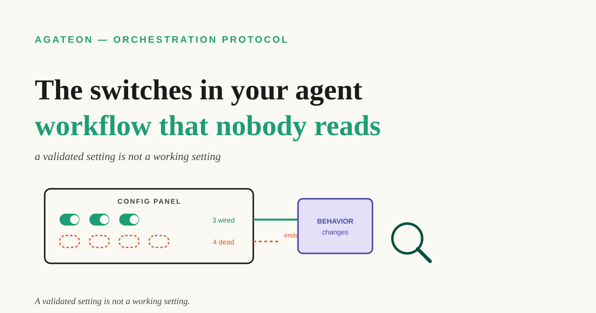

# The switches in your agent workflow that nobody reads

Most agent workflows accumulate switches — a timeout here, a skip-that-phase flag there, a light-mode declaration you added during a busy week. Each was added for a reason, and each is now part of the config file you believe describes how your system behaves.

Here is the uncomfortable question: how many of those switches actually change anything — not "are they documented," not "does the validator accept them," but how many have a *reader*?



**TL;DR** — A switch can be declared, documented, schema-validated, and still have zero effect, because validation only proves the declaration is well-formed, never that anything acts on it. You can find these dead switches yourself in three steps: list every config key, grep for its read points, and for any key whose only readers are validators, decide explicitly to wire it up or delete it. We ran this on our own protocol and found that most of our "tuning knobs" were in exactly that state — but also that our first diagnosis was wrong in an instructive way, which is the more useful half of the story.

## Validation is not consumption

The trap is that a validating system *feels* like a working system. Your config has a schema, the schema has an enum, a checker exits non-zero when you typo a value, and every run prints a green tick. All of that is real. None of it means the value is read by anything that changes behavior.

The failure mode is quiet because nothing about it fails. A dead switch does not crash, does not warn, and does not drift; it sits in the config looking authoritative. Its presence is what misleads you: you believe you have already tuned the thing, so you stop looking at it. The cost is not just the un-applied setting — it is the false confidence that you have an optimization you never got.

This is not specific to agent workflows — and it is the failure mode that sits underneath the question of [how much process to add in the first place](/blog/20260919/post-01-should-your-agent-workflow-use-a-protocol): you cannot judge whether your settings earn their keep if some of them were never connected. Feature flags that nothing branches on, CI environment variables read only by the linter that validates them, linter rules enabled in a config the linter never loads — same shape, different stack. Agent workflows are just unusually good at producing it, because the config surface grows faster than the number of places that can act on it.

## The three-step audit

You can run this on your own repository today, with grep and a text editor.

**Step 1 — List the config surface.** Every key your workflow accepts, from the schema or the docs. Not the ones you remember using; the full list.

**Step 2 — For each key, find its read points.** Grep the codebase for the key name, then classify each hit:

| kind of hit | example | counts as a reader? |
|---|---|---|
| schema / enum definition | `"ceremony": ("thin", "standard", "full")` | no |
| validator branch | `if ceremony in ("standard", "full"): exit 0` | no — it checks the value, it does not act on it |
| metadata / pass-through | a field registry, a formatter allowlist | no |
| **behavior branch** | `if design_trivial_declared(line): min_candidates = 1` | **yes** |

The distinction that matters is the last row. A validator asks "is this value legal?" A consumer asks "given this value, what should I do differently?" Only the second changes your system.


**Step 3 — Adjudicate every key with zero behavior branches.** Two honest options: wire it up (make something read it), or delete it. Keeping a documented-but-unread key is worse than either option, because it documents a behavior your system does not have.

## What we found, and where we were wrong

We ran this audit on our own protocol, which has six knobs that look like they tune how much process a task goes through. Here is the honest table, including the ones that survived.

| knob | what its docs claim | behavior branches | verdict |
|---|---|---|---|
| `ceremony: thin` | thins review for light tasks | none in the scripts, and none in the P2/P4 phase cards the orchestrator actually reads | declared, not consumed |
| `*_timeout_seconds` | bounds phase runtime | none — no subprocess timeout reads it | declared, not consumed |
| `phases:` | prunes which phases run | yes — the pruning check compares declared phases against the phase universe | consumed (as a check) |
| `internal_only` | legal condition for skipping release | yes — same pruning check | consumed (as a check) |
| `design_trivial` | lets a design phase write one option instead of two | yes — the gate (the check a phase must pass before the work may advance) lowers the minimum candidate count | **consumed (changes behavior)** |
| `risk_level` | escalates review depth | partly — one script branch reads `low` to permit pruning, but the review-mapping table has escalation rows only | half-wired |

The pattern that came out of it is the useful part: **most of our switches were being validated, and we had been reading validation as consumption.** Exactly one knob changed what the system did. The others either gated a check (useful, but not the behavior their docs described) or were inert.

And now the part worth more than the table. Our first diagnosis was that the whole chain was broken — that every knob was dead. We wrote that up, and then measured it properly, and the measurement did not support it. Two of the knobs *are* consumed. And the pruning convention, which no script forces, turned out to be followed about 94% of the time — 48 declared skips, 3 violations — because the phase card documents the convention and the orchestrating agent reads the card and honors it. One caveat on that figure: the repository it comes from had its requirement documents flattened by a one-time migration, so we cannot rule out that some declarations were written after the fact. Treat 94% as indicative, not proven.

So the accurate statement is narrower than the one we started with: no script enforces this convention, yet it is followed in nearly every case, with gaps only at the edges. A dead-switch audit that only greps for readers would have told us "no consumers, therefore no effect" — and been wrong about a convention that works.

### The mistake we made measuring it

I first computed that figure on a Friday afternoon, in a loop over every task directory, and the number that came back was **41.7%** — the opposite conclusion. My first reaction was that the convention was in far worse shape than the roadmap claimed. It was not; my script was. I had counted every phase absent from a task's declared list as a "skip," including the earliest phases that are never part of that list. The same data, with the scope corrected to the phases that can actually be pruned, gave 48 skips and 3 violations.

Two lessons, and the second one is the reason this section exists. First, a compliance number is only as good as its denominator, and config semantics are exactly where denominators get slippery. Second — and this is the generalizable one — **the same dataset gave me opposite answers depending on a definition I never wrote down.** If you run this audit on your own config, write your scope down *before* you compute, or you will get whichever answer you were expecting.

## The other half: how much config you are paying for

Finding dead switches is about correctness. There is a cost dimension too, and it is measurable.

In our workflow, each dispatched phase gets a context document assembled from task cards and protocol files. We wrote a small script to count what those documents contain (`agate-dispatch-cost.py`, run against our task `TAG0042`), and the excerpt below is its output verbatim:

```text
派发上下文    50 份 / 878749 B (858 KiB)
rev 修订重发  0 份 / 0 B = 0%   ← 可避免（整份重发）
卡片注入      403148 B = 46%
其中纯重复    333959 B = 38%   ← 可避免（同卡第 2..N 次）
```

Read the last two lines. **46% of the bytes we shipped to our own agents were injected reference cards, and 38% of the total was the same card sent again.** That is not a switch problem; it is a "we never counted" problem — [the same lesson as instrumentation generally](/blog/20260905/post-01-give-your-ai-agent-a-flight-recorder): if nothing counts it, nobody notices it drifting. Building the counter is the entire fix. The tool's own output is in Chinese; the ratio is the point.

One caveat, because this is exactly where a blog post would normally overclaim: the elapsed-time and token figures from the incident that started this investigation — roughly 18 hours and 3.5M output tokens for a 24-line change — are **not machine-verifiable**. They came from session records, and our own review flagged them as unreproducible. Treat them as an anecdote, not a measurement. The byte ratios above are reproducible; that is why they are the ones in the table.

## Run it this week

1. **List every config key** your agent workflow accepts, from the schema — not from memory.
2. **Grep each key and classify the hits.** Schema, validator, metadata, or behavior branch. Only the last one counts.
3. **For every key with zero behavior branches**, choose: wire it or delete it. Write the choice down.
4. **Write your scope down before computing any compliance number.** The definition decides the answer.
5. **Count what you actually ship to your agents.** Repeated card injection and full-document resends are usually the largest avoidable line item, and nobody notices without a counter.

None of this needs a protocol, a framework, or an install. It is grep, a table, and the discipline to distinguish "the config accepts this" from "something acts on this."

If you only take one thing: **a validated setting is not a working setting.** The validator proves your config is well-formed; only a reader proves it does anything.
