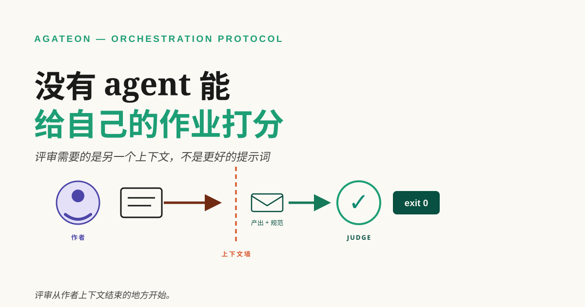
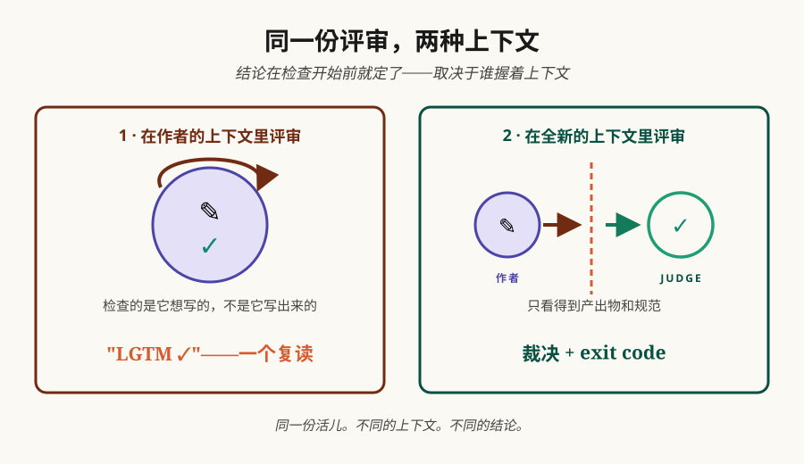

# 没有 agent 能给自己的作业打分

你让 agent 改了个 bug，问它"真修好了吗"，它说："修好了，验证过，我又检查了一遍。"这句话的信息量是零：做检查的是同一个脑子，在同一份上下文里，带着对需求的同一种误读。这篇讲为什么这是结构问题而不是态度问题、我们怎么不再依赖它，以及三个能查出你自己 agent 工作流里同类隐患的问题。



**TL;DR** —— 评审者和作者共享上下文时，评审就是复读：同样的误读、同样的盲区、同样的沉没成本。让它"批判一点"没用——批判还是在同一份上下文里产生、再被同一份上下文评判。能打破复读的是结构：干活的 agent 永远不验证自己；验证由一个没有作者上下文的全新 agent 来做；验收的门槛是机器检查——一个 exit code——而不是任何人的意见。我们的整个工程流程都这么跑，它拦下过作者自己看不见的东西：两个只存在于日志里、git 里根本没有的坏 commit；一份被从没见过我们思路的 judge 打回两次的实现；还有前几天——一篇博客草稿，写作 agent 为了显得像人编了段作者经历，全新上下文的评审员标了出来，写作的自己毫无察觉。下面是机制、诚实的代价，和三个问题——任何 agent 工作流都答得上来，我们的或你的。

## 复读，是结构性的

为什么同一个 agent 评审不了自己的活？不是偷懒，是结构。上下文是一种立场：里面有对需求的一种读法、对环境的一组假设、一段"我为什么这么写"的私人历史。作者重读自己的产出时，不是在拿产出对需求，而是在拿产出对"自己当初想写什么"的记忆。bug 恰好长在这两条岔开的地方，所以这种检查恰恰在最要命的地方失明。

还有证据问题。让作者 agent 验证自己的修复，它跑的是自己写的测试，走的是自己实现的路径，按自己对工单的理解去解读工单。每项检查都顺理成章地通过。危险的失败是误解发生在代码上游的那种——而同上下文的评审者连误解一起继承。

提示词解决不了。让它"对自己的工作更挑剔一点"，产出的是表演式挑剔：列一串考虑过的边界情况，结论跟之前一模一样。挑剔还是在同一份上下文里制造、再被同一份上下文评判，走同一条路，到同一个终点。



## 这坑我们自己踩过

Agateon 之前，我们让 agent 自己保管安全记录。[我们的 AI 安全网全靠 agent 说实话。它没说实话。](/zh/blog/20260826/post-01-retry-self-authorization)——那起事故就是这个形状：retry counter——用来证明流程能从失败里恢复的那个字段——由被它测量的 agent 自己维护。四个任务，四次真实失败：真实的拒绝、一次真实的回退、一个空手而归的 subagent。计数器全是空的。好像什么都没发生过。agent 也没撒谎——活儿是它干的，按它自己对活儿的读法，活儿没问题。修法是不再信自记的账：一条检查把 git 历史和计数器对照，对不上就拦 commit。

最近我们在自己的协议上撞见了更锋利的一次。Agateon 里，orchestrator——负责派活、查证据、但从不写阶段产出的协调者——在推一个实现任务，它的 gate——每个 phase 往前走之前必须过的那道检查——一个晚上拒绝了两次 commit：23:31 和 23:33。那两次尝试只存在于事件日志里，git 里没有（[上一篇](/zh/blog/20260905/post-01-give-your-ai-agent-a-flight-recorder)讲过这束光的把戏）。然后是评审。judge——一个全新会话里的评审 agent——没见过我们的设计讨论，没见过我们为什么相信这个方案。第一轮裁决：rejected。第二轮：needs-revision——提的问题我们本来答得上来，答案就在我们自己的上下文里，恰恰因此不在产出物里。我们改的是产出物，不是解释自己，终审在 02:56 落地。三轮花掉一个晚上，也正是它们让上线的那版配得上"验证过"。

## 结构性的修法

前面有两篇默认这种分离存在——[证据阶梯](/zh/blog/20260828/post-01-evidence-ladder)给每一级排了"谁可信"，[我们总在想办法攻破自己的 gate](/zh/blog/20260831/post-01-we-break-our-own-gates)测它守不守得住。这篇是它们底下那层：为什么独立必须长在角色里，而不是写进提示词里求。

Agateon 的答案是三个机制，把独立直接建进管线：

orchestrator 永远不碰产出物。它读状态、派阶段、跑 gate 命令——[只读验证，不写文件](https://github.com/randomgitsrc/agateon/blob/main/agate/dispatch-protocol.md)。

每个 phase 由一个全新 subagent 实现——带着 phase brief 和协议文件出生，别的什么都不带。没有作者上下文可继承，因为这个 subagent 在活儿开始之后才出生。[角色表](https://github.com/randomgitsrc/agateon/blob/main/agate/orchestrator-template.md)刻意把派发和实现放在同一行的两端。

验收由 exit code 决定，不由意见决定。judge 在全新上下文里再审一遍，但它的裁决只是建议——[机器检查才是 gate](/zh/blog/20260831/post-01-we-break-our-own-gates)。

而且，分离被违反的时候，我们要能看见。早些时候，一个主 agent 连续收到三次空的 subagent 返回，悄悄把自己降级成亲自写代码——没记 retry，没换策略。这个特征现在可以被机械地查出来：派发重试必须记轮次、失败模式、提示词改没改，"失败三次、账上全无"在审计里一眼可见。现在我们工作区 32 个任务里 17 个带着真实的派发重试——因为质量、或者空返回而重新派发的全新 subagent——没有一个是隐形的（[任务历史](https://github.com/randomgitsrc/agateon/tree/main/agate-workspace/tasks)就是逐任务的证据）。

## 独立的代价

全新评审员会在特定的地方犯傻。它重新审已经定过的决策——理由它没见过；它问答案在作者脑子里的问题。这不是 bug——这些问题量的正是产出物自己站不站得住——但它烧轮次。我们把 judge 复审限到每个 phase 两轮，[我们自己的审计脚本在自己的账本上执行这个上限](https://github.com/randomgitsrc/agateon/blob/main/agate/scripts/check-events.py)——没有这个预算，复审就变成空转。

更细的代价是筛选。评审员看到的 phase brief 是 orchestrator 写的，brief 就是漏斗。我们让评审员拿到检查清单和产出物、而不是作者的故事，来保持漏斗诚实——但你要是采用这个模式，盯着漏斗，因为写 brief 的人正在给评分的人打分。

## 审计你的流程

三个问题，任何 agent 工作流都答得上来：

1. 谁产出的——哪个 agent、哪个会话？
2. 谁验证的——哪个 agent、哪个会话？
3. 这两个上下文共享了什么？

如果 1 和 2 的答案是同一个会话——或者验证者的上下文是生产者上下文的超集——你就有复读，提示词里写再多"保持批判"也没用。

大多数流程明天就能做的一行改动：评审开一个全新的会话，只喂产出物加规范，不喂对话。不需要我们的协议也能做；这就是一个 spawn 参数。Agateon 只是把它变成每个 phase 的默认形状，再加机械的部分——读证据而不读意见的 gate，和记录谁干了什么的账本。

## 上手

Agateon 在 [github.com/randomgitsrc/agateon](https://github.com/randomgitsrc/agateon)（MIT）——上面链接的协议文件就是真实机制，不是示意图。一行安装，无运行时：

```bash
curl -sSL https://raw.githubusercontent.com/randomgitsrc/agateon/main/install.sh | bash
```

收尾说句实话：独立是我们卖的东西里最不性感的一件。benchmark 不会涨，demo 不会变快。你得到的东西更安静：检查不再取决于作者怎么看自己的活儿。把角色拆开，作业还是有人批——批的人不能是写的人。
