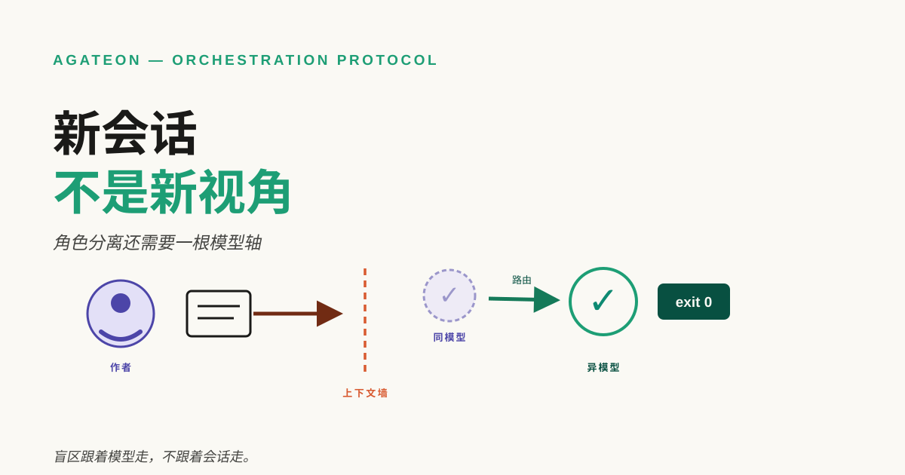
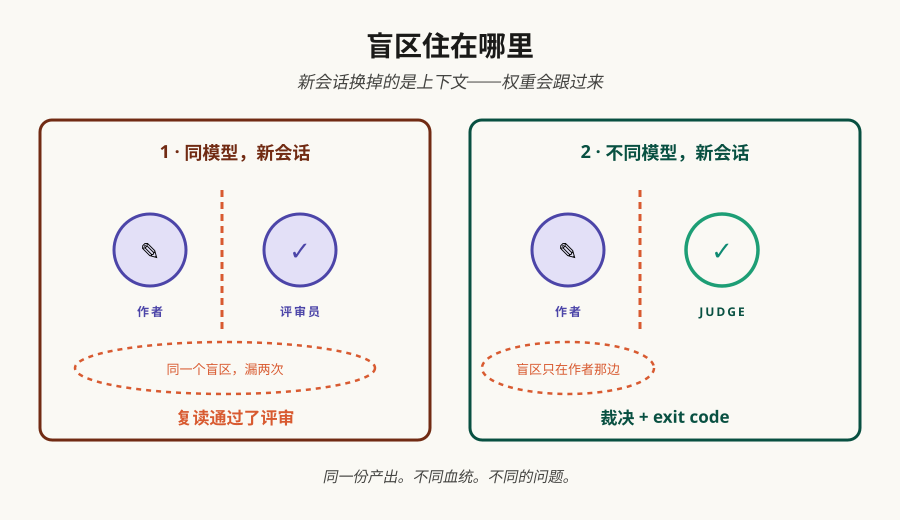

# 新会话不是新视角

上一篇给的办法：把评审放进全新会话，不带作者的任何上下文。你照做了——评审员没见过对话、没见过推理、没见过沉没成本。但它跑的还是和作者同一个模型，而一个模型家族的盲区，多少个新会话都躲不开。



**TL;DR** —— 角色分离买到的是上下文独立：评审员继承不了作者的误读、推理和沉没成本。它继承得了的是模型。同一个模型的两个会话，带着同一套训练出来的反射去读同一份需求——一个模型家族普遍不擅长的失败，生产者和评审员会一起漏掉。我们自己的 [LIMITATIONS.md](https://github.com/randomgitsrc/agateon/blob/main/agate/LIMITATIONS.md) 把这条挂了几个月，标注是"无解"（"认知层面的隔离，不是真正的独立视角"），直到这周：v0.71.0 发布了派发路由，可以把任意 (phase, role) 派到不同的 model、甚至另一个 CLI。两条不变量保住它的诚实：候选只在基础设施失败时回落，gate FAIL 绝不触发换候选——不存在"换个评委试试"；gate 只认产出文件加 exit code，从不认生产者。代价也明说：同厂商换 model 是弱缓解，跨 CLI 子进程才是强缓解；不配置 = 逐字节现状；这是缓解，不是根治。下面讲三件事：盲区为什么能在新会话里活下来，路由怎么转，三问审计怎么查你自己的流水线。

## 盲区跟着模型走，不跟着会话走

为什么新会话解决不了？因为盲区从来就不住在会话里。模型的反射——什么一看就"显然对"、哪类边界"显然不用管"、什么样的自信措辞能盖住一个缺失的用例——来自训练。同一个模型的两个会话，把同一套反射带进同一份需求。角色分离拿掉的是对*这份*任务的共享误读——评审员不再继承作者的上下文；它没动的是模型对"什么大概率不重要"的共同感觉。

这些写在我们 [LIMITATIONS.md](https://github.com/randomgitsrc/agateon/blob/main/agate/LIMITATIONS.md) 的局限 2 里，措辞很小心：角色隔离能防"明显的偷懒"，防不住"系统性盲区"——这个模型家族普遍不擅长的边界，两个角色都会漏。我们发布角色分离的时候就知道这条，标了"部分"，登记为 ADR-006：同源模型隔离是认知层的，不是真正的独立。有段时间我们连机制都没有，只有一个名字，和一句观察：剩下的这部分恰好是提示词修不了的——缺口在两个会话内部都不可见。



## 模型这根轴

v0.71.0 补上了缺的维度。命令是 `agate dispatch route <phase> <role>`，流程（[协议 §0](https://github.com/randomgitsrc/agateon/blob/main/agate/dispatch-protocol.md)）故意做得无聊：查 (phase, role) 的路由配置；解析成档位或一条显式候选链 `{cli, model, effort?}`（effort 是 CLI 的推理力度档）；派给第一个候选；只在基础设施信号上落到下一个；链走完，就像这个功能不存在一样默认派发。

词表三档——bulk（高吞吐、低成本）、deep（难判断的活：architect、judge、一致性评审）、standard。standard 的职责特殊：它意味着"继承主 Agent 当前 model 的原生派发"，而且是所有 phase、role 的出厂默认。这让整个特性最强的保证成了最先被测的那条：**不配置 = 逐字节现状**。有专门的零变更测试断言它——没有路由配置时，每次派发走的代码路径和以前逐字节相同，账本里 0 条 dispatch_route 事件。

缓解强度取决于你路由到什么，协议里说得直白。`cli: native`——同平台、换 model——是*弱缓解*：同一条训练谱系，盲区大部分重叠；买到的是成本匹配和一点失败模式多样性。跨 CLI 子进程——比如把 judge 派到另一家厂商的 CLI——是*强缓解*：真正不同的训练谱系，"独立视角"这个词本来就该是这个意思。

## 两条不变量保住诚实

这类特性有一个会悄悄吃掉一切的失败模式：用回落链逃避坏的裁决。两条机械规则关掉这个口子。

**回落只修管道，不修裁决。** 候选链只在三类信号上回落——launch_fail、infra_error、no_parseable_output。一旦某个候选产出了任何 gate 能评的东西，路由就结束且成功，gate 接下来说什么都没关系。gate FAIL 是同一候选上的正常阶段 retry；路由器不会再有一次机会。理由码枚举里没有 gate_fail，[我们的审计脚本](https://github.com/randomgitsrc/agateon/blob/main/agate/scripts/check-events.py)机械拒绝任何想夹带它的事件。没有这条，每次拒绝都会诱使回落到一个更好说话的 model，悄悄变成"换一个评委试到过为止"。

**gate 不认生产者。** 协议把第二条前提直接写明：gate 读产出文件和 exit code，永远不认谁生产的——现在不、以后也不得为跨 CLI 产出定制 gate。gate 一旦需要知道生产者是谁，路由决策就会漏进判断里。

而每次回落都留痕：每个路由决策写一条 dispatch_route 事件——试过哪些候选、理由码、最终选择——进[哈希链账本](/zh/blog/20260905/post-01-give-your-ai-agent-a-flight-recorder)（append-only 的事件日志，每行和上一行哈希相链）。回落链太顺滑，就会变成回避出口；对冲它的，是协议在所有别处已经在用的那套——回落没写事件，后面的审计就看不见它发生过。

## 设计本身被当代码审了

还有一件事值得展示，因为这个模式这次用在了它自己身上。路由设计文档在同一天走了两轮外部独立评审。第一轮 **FAIL**，两个 blocker，同一个物种：证据强度在转述中被压扁了。research 报告把 Codex 的 `spawn_agent` schema 标为模型自述；设计文档把它引成"端到端实测通过"，和真正实测过的平台 model 传参混在一起。同样的压扁还落在一条 OpenCode bug 上：报告里是*推理*，文档里成了*复现*。评审员要的不是"改措辞"——是拆开证据等级，逐条写清每个声称实际站在什么上：在模型自述里没看到一个字段，不等于那个字段不存在。第二轮 **PASS**，留了一条可见的尾巴：tmux 实测环境代表性的说明，判为非阻塞；tmux 层因此挂 flag 默认关，等目标环境复跑。这就是[证据阶梯](/zh/blog/20260828/post-01-evidence-ladder)对我们自己设计文档的一次执行——也是这篇里所有声称的口径为什么长这样。

## 它没解决什么

不配置就保持逐字节现状，我们自己工作区的配置就是这么发布的——这个仓库里的[路由文件](https://github.com/randomgitsrc/agateon/blob/main/agate-workspace/dispatch-routing.yaml)装着注释掉的示例和两个空 mapping。开不开是运维决策，按机器逐台做，对着实际装了什么；协议拒绝假装这个选择跨机可复现。同厂商换 model 共享训练谱系的大头，所以"弱缓解"不是谦虚。而即使是强配置，写路由表的还是主 Agent——哪个 model 有资格评审什么，仍然是人和主 Agent 的选择，从外部无约束，和系统里所有别的判断收敛到的那个单点同构。它拓宽了你可有的独立性；它没有自动化"你要多少独立性"的判断。

## 审计你的流水线

三个问题，任何 agent 管线都答得上来：

1. 这个产出是哪个 model 做的？
2. 哪个 model 评审的它？
3. 这两个共享训练谱系吗——同家族、同厂商、同基座？

如果 1 和 2 是同一个 model，你的评审员继承了生产者的系统性盲区，会话多新都没用。最小改动：至少把评审角色路由到不同的 model；不同 CLI 是强版本。回落保持只认基础设施，每次回落都记日志。

## 上手

v0.71.0 已打 tag 上线：`agate dispatch route`、[档位词表](https://github.com/randomgitsrc/agateon/blob/main/agate/rules/dispatch-tiers.yaml)、项目级路由文件、配置的[校验器](https://github.com/randomgitsrc/agateon/blob/main/agate/scripts/check-dispatch-routing.py)——全部 MIT，在 [github.com/randomgitsrc/agateon](https://github.com/randomgitsrc/agateon)：

```bash
curl -sSL https://raw.githubusercontent.com/randomgitsrc/agateon/main/install.sh | bash
```

会话这根轴你已经有了；模型这根轴离你一个配置文件。两个都用——上下文优先，血统其次，账本不能少。
