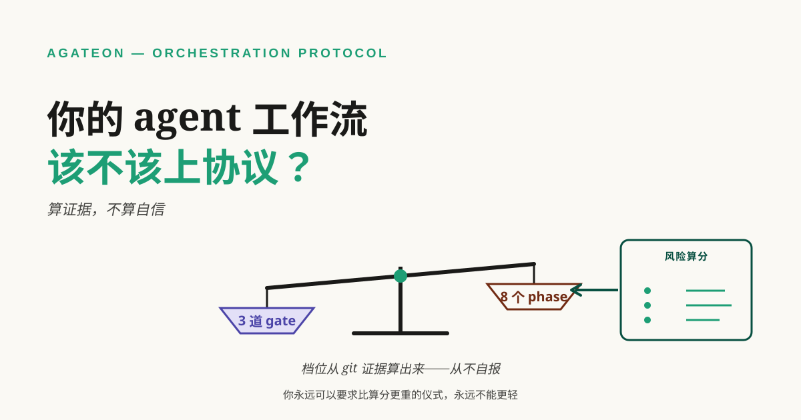
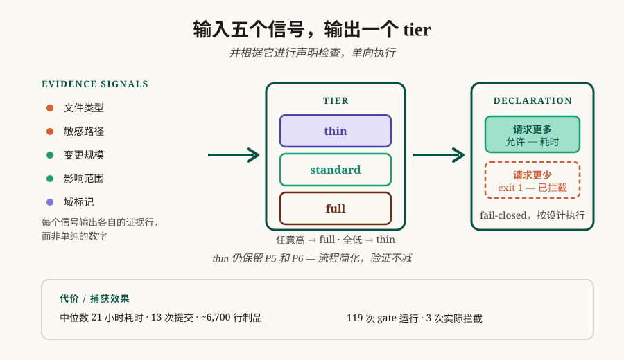

# 你的 agent 工作流到底该用多重的流程？

给 agent 工作流加流程，本质是一笔交易：你现在付出确定的时间与注意力成本，换那些以后不会发生的失败。这笔交易两个方向都会做错。流程太重，agent 的预算都花在写状态报告上；流程太轻，你会在最后才发现"做完了"的意思是"agent 不说话了"。



**TL;DR** —— 这个决定通常是靠感觉做的：要么是 agent 对自己任务的感觉，要么是你对 diff 大小的感觉——而这两种感觉以同一种方式不可靠。去算证据：从 diff 上读五个信号（文件类型、敏感路径、改动规模、反向引用影响面、领域标记），它们会告诉你这次改动该走轻流程、标准流程，还是全套。然后让声明朝一个方向可检查：任何人都可以要求比证据支持的**更严**，要求更松则被拦下。这套评分表不需要我们提供任何东西——五个信号全都能从 `git diff --cached` 加一个 grep 算出来，你今天下午用一张表格就能跑。下面是这套评分表、单向规则、我们为此付出的成本，以及什么时候你该跳过它去写个脚本。

## 复杂度自述朝一个方向不可靠

给任务估规模最直觉的做法是问 agent：这个任务复杂吗？这没用，而且不是因为 agent 撒谎：只要听起来够勤勉，它会把一行修复说成"架构级改动"。自报的复杂度会朝着"报告者觉得你期待什么"的方向漂移。

人这边的版本更隐蔽，也更糟。我们因为改动"看起来很小"就跳过流程——而规模确实一眼能估，风险不能。一个改 auth 检查的四行改动，和一个改日志文案的四行改动，在 diff 统计里长得一模一样。两种估算以同一种方式失败：它们读的是可见的表面，漏掉的是连接关系。

我们自己的任务 brief 就是这个失败的缩影。我核对某一批的 brief 时，它引了某个 CI 脚本的行号和一个证据文件计数。两个都错了——行号差了四行，计数差了五个。没人撒谎，也没人明显粗心；只是那些数字是被回忆出来的，而不是重新读出来的。如果连你自己写的文档里的数字都能这么轻易漂移，那么规划阶段凭记忆产出的复杂度估算，就不足以当作"该配多少流程"的依据。

## 五个信号，从 diff 上读出来

给这次改动打五个信号的分，每个都是算出来的，不是声称出来的：

| 信号 | 读什么 | 什么情况算高 |
|---|---|---|
| file-type | 暂存路径 | 碰到核心/共享代码或构建、CI 配置 |
| sensitive-path | 路径关键词 | security、auth、permission、data-model |
| change-size | 暂存源文件数 | 超过五个 |
| impact | 反向引用 | 被改的模块在仓库别处被 import |
| domain-markers | 声明的领域 | 只做标注——不参与定档 |

合成规则故意做得无聊且二值：任一信号高就是 `full`；全低才是轻流程候选；其余是 `standard`。档位不由数值阈值决定，因为阈值只会把争论挪到"线画在哪"。

每个信号都是客观的，这正是它能被搬走的原因——你可以在决定之前手工跑一遍、放进 pre-commit hook，或者用一张表格。信号也是本地的：如果你的仓库里有个目录天生危险，把它加进 sensitive-path 列表。评分表是那个想法，关键词是你自己的。

我们把它实现成了 [`agate-risk-score.py`](https://github.com/randomgitsrc/agateon/blob/main/agate/scripts/agate-risk-score.py)。它对一个近期基础设施加固任务的逐字输出如下（算分时暂存区无改动；这个工具的文案本来就是中文，重点在结构）：

```text
risk_score: 6
tier: thin
file-type: low (无暂存改动)
sensitive-path: low (无暂存改动)
change-size: low (source files=0 <= 5)
impact: low (无反向引用)
domain-markers: [backend]
git_ok: true
```

最后一行是值得抄进你自己评分器的部分。git 读不到时，工具不会悄悄返回一个友好的默认值——它报 `git_ok: false`，消费方把它当失败处理。算不出来的分说明不了任何风险，所以它绝不能被读成低分。评分器的失败方式必须是响亮的，不能是放行的。



## 让声明朝一个方向可检查

算分是一半机制。另一半是：谁声明流程档位，就得拿这个声明去**对**算分。

你随时可以选**比算分更严**的：一个算成轻流程的任务你声明 `full`，那是你的自由，代价只是时间。当算分是 `standard` 或 `full` 时申请走**轻流程**会被拦——检查会把声明和算出来的档位比对，对不上就 exit 1，任务原地不动。在我们的实现里，中间那种情况还没被强制：算分 `full` 的任务声明 `standard`，今天能过检查，所以 `full` 隐含的那些额外义务并没有被机械强制。这个缺口是真的，把它讲出来比讲口号重要——代码做的是"单向检查"，而"永远不能更松"会声称得比代码更多。

这条规则的可搬走版本就一句话：流程深度的声明应该能被证据检查，而一个无法验证的声明应该默认倒向更严。这也正是大多数流程争论的终点。分歧不再是"我们需要这个吗"，而是"这是五行证据，哪一行是错的？"

## 它花多少，以及怎么给你的算一笔

你不该拿别人的数字来决定采用流程，但我们的数字可以当一个刻度参考。在我们自己的工作区里量 37 个任务：

| 指标 | 中位数 | 备注 |
|---|---|---|
| 日历跨度 | 约 21 小时 | 该任务首个到最后一个 commit |
| commit 数 | 13 | 最多 44 |
| 阶段产物行数 | 约 6700 | 跨约 37 个文档 |
| 派发重试 | 19/37 个任务 | 至少一条记录在案的重试 |

请把这张表当警告读，不是当推销读。这个跨度不是 agent 的运行时间——它是日历时间，大头在等人来看一眼。所以流程的价格不是算力，是你的注意力：花在沿途的 gate 上，而不是花在最后那一次 review 里。这里没有任何东西能让 agent 更快、让任务更早完成。如果你的问题是吞吐量，那这套是错的工具。

要给你自己的场景定价，在决定任何事之前先量一周这三件事：

1. **一个任务从首个 commit 到最后一个 commit 要多久**，其中多少是在等人？
2. **一个任务要几个 commit**，其中多少个是在修已经"做完"的东西？
3. **一个任务在你验收之后多久回来一次是错的**，每次的代价是多少？

如果第 3 题的答案是"很少，而且很便宜"，那就到此为止。流程是保险，而你不会为承受得起的损失买保险。

作为刻度参考：我们的 append-only 事件账本记录了 119 次 gate 运行，其中 115 次以该 phase 的通过码结束、1 次带警告通过、3 次是真拦截。真正被 gate 拦下过的只有 2 个任务——而诚实的母数是那 14 个有账本的任务，因为账本是这个仓库走到中途才引入的。一道很少开火的 gate 是在按设计工作，但谁都不该指望它省下惊天动地的一大笔。它覆盖的是那些你预见不到的失败。

## 什么时候这些你都别用

- **一次性脚本和小修复。** 如果整个改动就是你会花五分钟看完的一个 commit，多阶段流水线是纯开销。写脚本、跑测试、发出去。
- **没有机器可校验信号的活。** 杠杆来自 gate 读 exit code 和 diff。如果你的"完成"定义是"设计文档读起来不错"，gate 就没有东西可抓，你在为那些帮不上忙的部分付仪式成本。
- **探索和 spike。** 研究类任务没有验收标准可验，给它算分算出来的档位毫无意义。给 spike 定时，扔掉，再把真正的任务放进 gate 里跑。
- **你付不起那份注意力的时候。** 成本是人不是算力。如果这周没人能看 gate，它们就变成一条你会跳过的队列——而被跳过的 gate 比没有 gate 更糟，因为产物里仍然记着"验证过了"。
- **你需要跨机器可复现的时候。** 我们的路由和算分配置是刻意做成逐机、机会式的。如果两个工程师必须得到逐字节相同的流水线，这个设计选择就是跟你对着干。

## 决定之前

四个问题，对着你自己的环境答：

1. **你的"完成"作为一个机器可校验信号长什么样**——一个 exit code、一个 diff、一个计数？说不出来，加多少流程都救不了你。
2. **你的 agent 现在多久回来一次是错的，你怎么知道的？** 第二个问句答不上来，你就是在凭记忆决策——正是这篇讲的那个错误。
3. **一次坏产出在你这里值多少**——重跑一次、构建坏掉、生产事故，还是客户看得见的谎言？
4. **谁来读这些 gate？** 说出那个人的名字。如果是"没人，我们信绿勾"，那你买的是仪式，不是验证。

如果第 1、2 题答得干脆，第 3 题很贵，那么这套流程能自己赚回来。如果第 3 题很便宜，或者第 4 题说不出名字，跳过它：那种活，一个脚本加一次 code review 就是正确答案。

## 想要现成实现的话

上面那套评分表不需要我们提供任何东西——五个信号、一张表格、加上单向规则。如果你更想要能跑的代码，Agateon 是 MIT 许可的，评分器就是单个脚本，你坐下来一次能读完：[github.com/randomgitsrc/agateon](https://github.com/randomgitsrc/agateon)。

```bash
curl -sSL https://raw.githubusercontent.com/randomgitsrc/agateon/main/install.sh | bash
```

让你对流程深度的声明可以被检查，并让检查朝更严的方向失败。这一条不管你装不装任何东西都成立。
