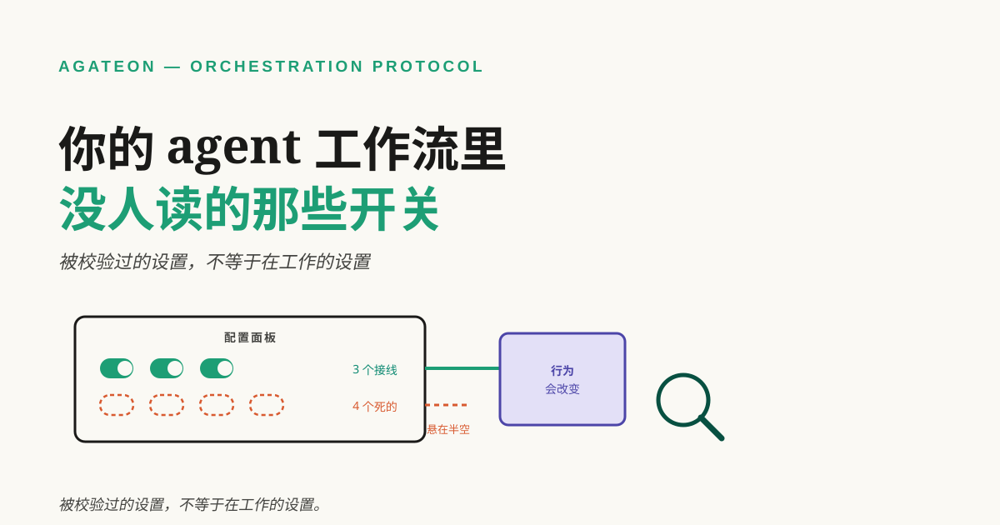

# 你的 agent 工作流里没人读的那些开关

大多数 agent 工作流都会攒下一堆开关——一个超时，一个"跳过某阶段"，一个你在忙的那周加上去的轻量模式声明。每一个当初都有理由，而如今它们都是配置文件的一部分——你相信这份配置描述了你的系统实际怎么跑。

这里有个不太舒服的问题：这些开关里，有多少真的改变了什么——不是"有没有文档"，不是"校验器认不认"，而是有多少**有读取方**？



**TL;DR** —— 一个开关可以被声明、被文档化、被 schema 校验通过，却依然零效果：因为校验只能证明声明格式合法，永远不能证明有东西对它做事。你自己三步就能找出这些死开关：列出每个配置键，grep 它的读取点，凡是"唯一读者是校验器"的键，明确裁决——接线或删除。我们在自己的协议上跑了一遍，发现大部分"调节旋钮"正处在这个状态；但同时也发现，我们的第一个诊断以一种很有教育意义的方式错了，而那才是这个故事里更有用的那一半。

## 校验不等于消费

这个陷阱在于：一个会校验的系统，**感觉上**就像个能工作的系统。你的配置有 schema，schema 有枚举，你把值打错时检查器会非零退出，每次运行都打出绿色对勾。这些都是真的。但它们没有一条意味着：这个值被任何会改变行为的地方读到了。

这个失效模式之所以安静，是因为它没有任何一处失败。死开关不会崩溃、不会告警、不会漂移；它待在配置里，看着很有权威。而它的存在本身就在误导你：你以为自己已经调过那件事了，于是不再看它。代价不只是那个没生效的设置——更是那份"我做过一个优化"的虚假信心。

这不是 agent 工作流特有的——而且它正是["该配多少流程"这个问题](/zh/blog/20260919/post-01-should-your-agent-workflow-use-a-protocol)底下的那个失效模式：如果有些设置从来没被接上，你就无法判断你的设置是否值当。没有任何分支去读的 feature flag、只有校验它的那个 linter 才会读的 CI 环境变量、写在一个 linter 从不加载的配置里的 lint 规则——同一个形状，不同的技术栈。agent 工作流只是格外擅长生产它，因为配置面长得比"能对它做点什么的地方"快。

## 三步审计

你今天就能在自己的仓库上跑这套，只需要 grep 和文本编辑器。

**第 1 步——列出配置面。** 你的工作流接受的每一个键，从 schema 或文档里来。不是你记得用过的那些，是完整清单。

**第 2 步——对每个键，找出它的读取点。** 在代码库里 grep 这个键名，然后把每一处命中分类：

| 命中的类型 | 例子 | 算读取方吗 |
|---|---|---|
| schema / 枚举定义 | `"ceremony": ("thin", "standard", "full")` | 不算 |
| 校验器分支 | `if ceremony in ("standard", "full"): exit 0` | 不算——它检查这个值，不对它做任何事 |
| 元数据 / 透传 | 字段注册表、格式化白名单 | 不算 |
| **行为分支** | `if design_trivial_declared(line): min_candidates = 1` | **算** |

真正要紧的是最后一行。校验器问的是"这个值合法吗"；消费方问的是"给定这个值，我该有什么不同做法"。只有后者会改变你的系统。


**第 3 步——对每个"零行为分支"的键做裁决。** 两个诚实的选项：接线（让某个东西去读它），或者删除。保留一个"有文档但没人读"的键，比这两个选项都差，因为它记录了一个你的系统并不具备的行为。

## 我们发现了什么，以及我们在哪里错了

我们在自己的协议上跑了这套审计。协议里有六个旋钮，看起来是用来调节"一个任务要走多少流程"的。下面是诚实的表格，包括那些活下来的。

| 旋钮 | 文档声称它做什么 | 行为分支 | 判定 |
|---|---|---|---|
| `ceremony: thin` | 为轻量任务薄化评审 | 脚本里没有；编排者实际读的 P2/P4 阶段卡里也没有 | 已声明，未被消费 |
| `*_timeout_seconds` | 限制阶段运行时长 | 没有——没有任何 subprocess timeout 读它 | 已声明，未被消费 |
| `phases:` | 裁剪跑哪些阶段 | 有——裁剪检查会把声明的阶段和阶段全集做比对 | 被消费（作为检查） |
| `internal_only` | 跳过发布阶段的合法条件 | 有——同一处裁剪检查 | 被消费（作为检查） |
| `design_trivial` | 让设计阶段只写一个方案而非两个 | 有——gate（阶段前进前必须通过的那道检查）据此下调候选方案数下限 | **被消费（改变行为）** |
| `risk_level` | 升级评审深度 | 部分——有一处脚本分支读 `low` 来允许裁剪，但评审映射表只有升级行 | 半接线 |

从里面浮出来的规律才是有用的部分：**我们的大部分开关都在被校验，而我们把校验读成了消费。** 真正改变系统行为的只有一个旋钮。其余的要么在给一道检查把关（有用，但不是它们文档里描述的那个行为），要么完全是惰性的。

接下来是比表格更值钱的部分。我们的第一个诊断是"整条链都断了"——每个旋钮都是死的。我们把它写了下来，然后认真测了一遍，而测量不支持这个结论。有两个旋钮**确实**被消费了。而且那条没有任何脚本强制的裁剪约定，实际遵守率大约是 94%——48 次声明跳过、3 次违反——因为阶段卡把约定写了下来，编排 agent 读了卡，然后照做。关于这个数字有一点说明：它来自的那个仓库，需求文档被一次迁移压平过，所以我们无法排除有些声明是事后补写的。把 94% 当指示性数字，不要当已证的。

所以准确的说法比我们一开始那个更窄：没有任何脚本强制这条约定，而它几乎每次都被遵守，缺口只在边缘。 一个只 grep 读取方的死开关审计会告诉我们"没有消费方，因此没有效果"——而对一条实际生效的约定，这个结论是错的。

### 我们测量时犯的错

我第一次算那个数字是在一个周五下午，写了个循环遍历每个任务目录，回来的数是 **41.7%**——完全相反的结论。我的第一反应是这条约定比路线图声称的糟糕得多。不是，是我的脚本糟糕。我把任务声明列表里缺席的每一个阶段都算成了"跳过"，包括那些从来就不属于该列表的最早阶段。同一份数据，把范围修正到真正可被裁剪的阶段之后，给出的是 48 次跳过、3 次违反。

两个教训，第二个正是这一节存在的理由。第一，一个合规率数字的好坏只取决于它的分母，而配置语义恰恰是分母最容易打滑的地方。第二——也是可推广的那条——**同一份数据给了我相反的答案，只取决于一个我从未写下来的定义。** 如果你要在自己的配置上跑这套审计，先把你的范围写下来再算，否则你会得到你原本期待的那个答案。

## 另一半：你为配置付了多少钱

找出死开关是正确性问题。还有成本维度，而且它是可度量的。

在我们的工作流里，每个被派发的阶段会拿到一份上下文文档，由任务卡和协议文件拼装而成。我们写了个小脚本统计这些文档里装了什么（`agate-dispatch-cost.py`，跑在我们的 `TAG0042` 任务上），下面是它输出的逐字摘录：

```text
派发上下文    50 份 / 878749 B (858 KiB)
rev 修订重发  0 份 / 0 B = 0%   ← 可避免（整份重发）
卡片注入      403148 B = 46%
其中纯重复    333959 B = 38%   ← 可避免（同卡第 2..N 次）
```

看最后两行。**我们发给自己的 agent 的字节里，46% 是注入的参考卡片；而总量的 38% 是同一张卡被重复发送。** 这不是开关问题，是"我们从没数过"的问题——和[埋点的一般教训](/zh/blog/20260905/post-01-give-your-ai-agent-a-flight-recorder)一样：没有东西去数它，就没人会发现它在漂移。把计数器建起来就是全部的解。

有一条说明，因为这里正是博客文章通常开始夸大的地方：最初引发这次调查的那个事件里的耗时与 token 数字——大约 18 小时、350 万输出 token，换一个 24 行的改动——**不可机器复核**。它们来自会话记录，而我们自己的评审把它们标为不可复现。把它们当轶事，不要当测量。上面那些字节比例是可复现的；这正是进表格的是它们的原因。

## 本周就跑一遍

1. **列出你的 agent 工作流接受的每一个配置键**，从 schema 来——不是从记忆来。
2. **grep 每个键并给命中分类。** schema、校验器、元数据，还是行为分支。只有最后一种算数。
3. **对每个零行为分支的键**做选择：接线，或者删除。把这个选择写下来。
4. **在算任何合规率之前，先把你的范围写下来。** 定义决定答案。
5. **数一数你实际发给 agent 的东西。** 重复的卡片注入和整份文档重发通常是最大的一笔可避免开销，而没有计数器就没人会注意到。

这些都不需要协议、框架或安装。它就是 grep、一张表，以及区分"配置接受这个值"和"有东西对这个值做事"的纪律。

如果你只带走一件事：**被校验过的设置，不等于在工作的设置。** 校验器证明你的配置格式合法；只有读取方能证明它做了什么。
